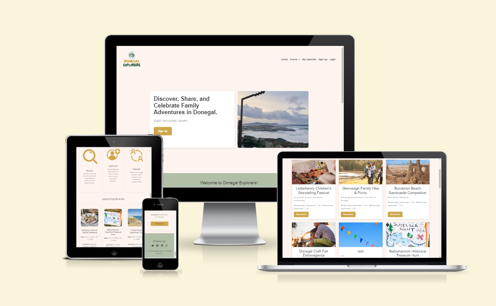
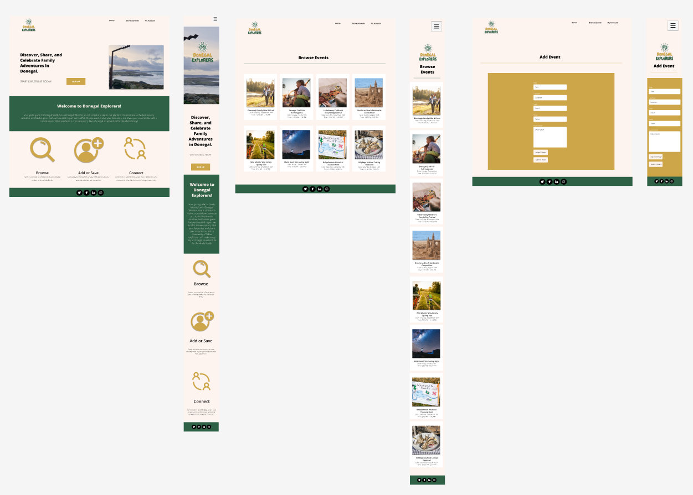
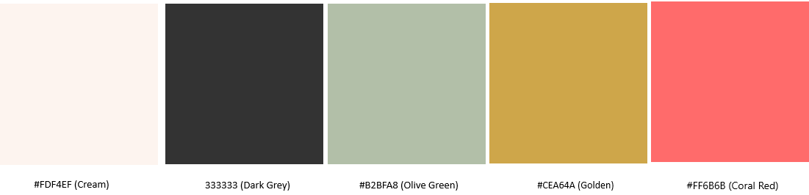

# **_Donegal Explorers - Project Portfolio 4_**

This document provides an overview of the Donegal Explorers website I have developed using Django, HTML, CSS, and JavaScript. The purpose of this project is to offer a digital platform where users can browse, add, and manage events happening in Donegal. This website allows event organisers to promote their events while giving local residents an easy way to discover upcoming activities, plan their schedules, and engage with the community. With user authentication, event submission, and notifications, Donegal Explorers aims to build an interactive space to connect people with local events.

The live site can be viewed here - <a href="https://donegal-explorers-22a6c2ed48a2.herokuapp.com/" target="_blank" rel="noopener">Donegal Explorers</a>

# Contents

* [**Website Objectives**](<#website-objectives>)
* [**Agile Methodology**](<#agile-methodology>)
* [**User Experience UX**](<#user-experience-ux>)
    * [**Client Background and Goals**](<#client-background-and-goals>)
    * [**Target Audience**](<#target-audience>)
    * [**User Stories**](<#user-stories>)
    * [**Market Research**](<#market-research>)
* [**Design**](<#design>)
    * [**Planning and Development**](<#planning-and-development>)
        * [Strategy](<#strategy>)
        * [Scope](<#scope>)
        * [Structure](<#structure>)
        * [Skeleton](<#skeleton>)
        * [Surface](<#surface>)
    * [**Colour Scheme and Typography**](<#colour-scheme-and-typography>)
        * [Typography](<#typography>)
        * [Colour Scheme](<#colour-scheme>)
    * [**Website Logo**](<#website-logo>)
    * [**Final Wireframes**](<#final-wireframes>)
* [**Features**](<#features>)
    * [**Generic Website Features**](<#generic-website-features>)
        * [Responsive Design](<#responsive-design>)
        * [Clear Navigation](<#clear-navigation>)
        * [Hero Section](<#hero-section>)
        * [Call-to-Action Buttons](<#call-to-action-buttons>)
        * [Favicon](<#favicon>)
        * [Footer](<#Footer>)
        * [Testimonials](<#testimonials>)
        * [404 Page](<#404-page>)
        * [Contact Page](<#contact-page>)
    * [**Homepage Features**](<#homepage-features>)
        * [About Section](<#about-section>)
        * [Services Section](<#services-section>)
        * [Pricing Section](<#pricing-section>)
    * [**About Page Features**](<#about-page-features>)
        * [Main About Section](<#main-about-section>)
        * [Reasons to Work With Me Section](<#reasons-to-work-with-me-section>)
    * [**Service Page Features**](<#service-page-features>)
        * [Introduction Section](<#introduction-section>)
        * [Main Services Section](<#main-services-section>)
        * [Process Section](<#process-section>)
     * [**Future Features**](<#future-features>)
        * [Portfolio Page](<#portfolio-page>)
        * [Content Request Form](<#content-request-form>)
        * [Client Dashboard and Integration](<#client-dashboard-and-integration>)
        * [Blog Page](<#blog-page>)
* [**Technologies Used**](<#technologies-used>)
* [**Deployment**](<#deployment>)
    * [**Opening the repository**](<#opening-the-repository>)
    * [**Forking the repository**](<#forking-the-repository>)
    * [**Cloning the repository**](<#cloning-the-repository>)
* [**Testing**](<#testing>)
    * [**Validator Testing**](<#validator-testing>)
        * [HTML Validation](<#html-validation>)
        * [CSS Validation](<#css-validation>)
    * [**Responsivity Testing**](<#responsivity-testing>)
    * [**Accessibility Testing**](<#accessibility-testing>)
    * [**Performance Testing**](<#performance-testing>)
    * [**Testing of User Stories**](<#testing-of-user-stories>)
    * [**Manual Testing of Features**](<#manual-testing-of-features>)
    * [**Bugs**](<#bugs>)
* [**Credits**](<#credits>)
* [**Acknowledgements**](<#acknowledgements>)

# Website Objectives

The **Donegal Explorers** website is designed to provide users with a comprehensive platform for discovering, organising, and managing events in Donegal. The primary goal is to create a user-friendly space where event organisers can submit and promote their events, and site visitors or registered users can browse, save, and rate events. This project also emphasises building community engagement through features like event calendars, user feedback via ratings and comments, and personalised notifications.

**Key objectives include:**
- Providing an intuitive event submission system for organisers.
- Offering a seamless browsing experience for site visitors.
- Allowing users to save events to their personal calendars.
- Facilitating user feedback through event ratings and comments.
- Ensuring the site is responsive, accessible, and easy to navigate on various devices.

[Back to top](<#contents>)

# Agile Methodology

## Agile Methodology

Throughout the development of the Donegal Explorers website, Agile methodology was followed to ensure that the project was delivered efficiently, with flexibility and adaptability to evolving requirements. The Agile process facilitated regular reflection, continuous improvement, and incremental delivery of valuable features. This iterative approach was particularly beneficial for managing scope and ensuring high-quality outcomes aligned with user needs.

### Key Agile Practices Utilised:

1. **Sprint Planning and Milestones**
   - The project was broken down into multiple milestones, representing key features or sections of the website (e.g., User Authentication, Enhanced Event Interactions, etc.).
   - Each milestone was treated as a sprint, with a clear focus on what functionality would be completed and tested before moving to the next.
   - I set deadlines for each milestone but remained flexible, revisiting and adjusting priorities as needed to ensure the highest priority features were delivered first.

2. **User Stories**
   - User stories were the foundation of each milestone. They were written from the perspective of different types of users (e.g., event organisers, site visitors) to capture the desired functionality.
   - Each user story was assigned a priority (e.g., Must Have, Should Have, Could Have) to guide development focus.
   - The GitHub project board helped track user stories, categorise them into specific sprints, and ensure they were addressed iteratively.
   - User stories helped ensure that features were aligned with user goals and needs, ensuring a user-centric design process.

3. **GitHub Project Board**
   - A GitHub Projects board was created and used to manage tasks, user stories, and feature development. 
   - The board was organised into columns such as **Backlog** and **In Progress**, allowing for easy tracking of the progress of each task.
   - This board provided full visibility into the progress of each feature and task, ensuring that the project remained on track and any blockers were identified early.
   - For example, when the "Event Submission" user story was completed, it was moved to **Done**.

   [GitHub Project Board - Donegal Explorers](https://github.com/users/SophieMcGee/projects/2)

4. **Regular Retrospectives**
   - Retrospectives were conducted at the end of each sprint/milestone to reflect on what went well, what could be improved, and any issues encountered.
   - This iterative feedback process allowed me to refine the development process, address technical debt, and ensure any lessons learned were incorporated into future sprints.
   - Retrospectives were critical in improving feature delivery times, identifying potential challenges early, and enhancing code quality over time.

5. **Continuous Integration and Testing**
   - I applied continuous integration principles by running tests after the completion of each milestone.
   - Each feature was tested in isolation and integrated into the overall project only when it met the acceptance criteria defined by its user story.
   - Any issues identified during testing were tracked in GitHub issues and addressed before moving forward, ensuring the integrity of the codebase throughout development.

6. **Prioritisation Using MoSCoW**
   - The MoSCoW method (Must Have, Should Have, Could Have, Won’t Have) was applied to prioritise features and user stories, ensuring that the most critical aspects were addressed first.
   - For example, user authentication (Must Have) was implemented before features like comment moderation (Could Have).
   - This approach helped maintain focus on delivering the core functionalities needed for the website to function, while leaving less critical features for later development.

### Example Milestones and User Stories

The project was divided into several major milestones, each covering specific functionalities of the website. Each milestone was made up of detailed user stories that were tracked, tested, and completed throughout the project. These are available to view in the section below.

# User Experience (UX)

## Client Background and Goals

The **Donegal Explorers** platform is designed to provide a comprehensive and intuitive space for discovering and managing events in Donegal. As both the developer and a local resident, I recognised the need for a platform that would simplify event management while encouraging community engagement. The goals for this website include:

* **Attracting a broad user base** – The website is aimed at a diverse group of users, from event organisers to local attendees and tourists looking for events in Donegal.
* **Ease of use and accessibility** – A clean and intuitive interface is essential for helping users find events easily and manage their event preferences, such as saving events to calendars and setting up notifications.
* **Promoting engagement** – The platform aims to enhance community engagement by providing users with tools to search, save, and rate events, as well as leave comments and share experiences.
* **Multiple contact points** – Clear calls-to-action (CTAs) are strategically placed throughout the site, encouraging users to interact with event organizers and stay connected via notifications.

[Back to top](#contents)

## Target Audience

Following market research into other event websites and the types of events in the area, the platform is designed to meet the needs of the following target audiences:

* **Event organisers** looking to promote their events.
* **Local residents and tourists** seeking a convenient way to find local events in Donegal.
* **Community groups** that want to advertise public gatherings and activities.
* **Individuals** interested in saving and tracking events to attend.

[Back to top](#contents)

## User Stories

**User Stories Summary**

Below is a table that summarises the milestones/epics which were maintained within Github Projects. Each milestone represents an area of focus in the development process and includes user stories that were worked on to achieve specific goals. 

| **Milestone**                    | **Summary**                                                                                  |
|-----------------------------------|----------------------------------------------------------------------------------------------|
| **Frontend Design**               | Covers the frontend design and features, including favicon, layout consistency, and site info.|
| **User Account and Authentication**| Handles user registration, login/logout, email verification, password reset, and email resends. |
| **Enhanced Event Interactions**    | Focuses on user interactions with events, including rating events and viewing event details.  |
| **User Feedback and Notifications**| Covers user feedback mechanisms such as notifications for event interactions and confirmations.|
| **Initial Event Management Setup** | Handles core event management tasks, including adding, editing, and deleting events.          |
| **Site Navigation and Information**| Improves user experience by providing clear and accessible navigation and event information.  |
| **Event Calendar and Saved Events**| Allows users to save events to a calendar and manage their event attendance.                 |
| **Administrator Tools**           | Focuses on providing admin functionalities such as moderating user comments on events.        |
| **Testing and Documentation**     | Covers automated testing for key features and documentation for developers and users.         |

[Back to top](#contents)

The section below provides a comprehensive overview of each user story in the project, organised by milestones, along with the status of each user story.

**Detailed User Stories**

<b>User Story: View the site favicon</b>

* **Issue**: As a user, I can see a favicon in the browser tab so that I can easily identify the site when multiple tabs are open.

- The favicon is visible in the browser tab.
- The favicon matches the site branding.
- The favicon appears correctly across different browsers and devices.
* **Label**: Could Have  
* **Milestone**: Frontend Design  

<b>User Story: Customise site layout</b>

* **Issue**: As a user, I can experience a consistent layout and design across all pages so that the site feels cohesive and easy to navigate.

- The layout is responsive across all screen sizes.
- Consistent design elements (e.g., header, footer) are visible on all pages.
- The colour scheme is applied site-wide for uniformity.

* **Label**: Should Have  
* **Milestone**: Frontend Design  

<b>User Story: Clear Organisation Information</b>

* **Issue**: As a site visitor, I can quickly view information about Donegal Explorers so that I can understand if the site meets my needs.

- An 'About' section is visible on the homepage with key site information.
- A clear call to action (e.g., sign up or log in) is displayed.
- The homepage provides easy access to other important sections (e.g., events).

* **Label**: Could Have  
* **Milestone**: Frontend Design  

### **User Account and Authentication**

<b>User Story: Resend verification email</b>

* **Issue**: As a new user, I can request to resend the verification email so that I can activate my account if I didn’t receive the first email.

- A "Resend Verification Email" option is available on the registration confirmation page.
- Users receive a new verification email if the first one wasn’t received.
- Users can only request resending the email once every few minutes to prevent spam.

* **Label**: Should Have  
* **Milestone**: User Account and Authentication  

<b>User Story: Reset password</b>

* **Issue**: As a user, I can reset my password so that I can regain access to my account if I forget my login information.

- A "Forgot Password" link is visible on the login page.
- Users receive a password reset email with a secure link.
- Users can successfully reset their password and log in.

* **Label**: Must Have  
* **Milestone**: User Account and Authentication  

<b>User Story: Login and Logout</b>

* **Issue**: As a site user, I can log in and log out of my personal account so that I can manage my events securely.

- A login form requires valid credentials (email and password).
- Users receive a notification when successfully logged in or logged out.
- Incorrect login attempts display an error message.

* **Label**: Must Have  
* **Milestone**: User Account and Authentication  

<b>User Story: User Registration</b>

* **Issue**: As a first-time visitor, I can create an account on the Donegal Explorers app so that I can add, edit and delete my own event listings.

- The registration page requires a valid email address, username and password.

- Users are redirected to a success message after registering.

- Email verification is required to activate the account.

* **Label**: Must Have  
* **Milestone**: User Account and Authentication  

### **Enhanced Event Interactions**

<b>User Story: Rate events</b>

* **Issue**: As a user, I can rate events so that I can share my feedback with other users.

- Users can rate events from 1 to 5 stars.
- The average rating is displayed on the event detail page.
- Users can only rate an event once.

* **Label**: Should Have  
* **Milestone**: Enhanced Event Interactions  

<b>User Story: View an Event</b>

* **Issue**: As a site user, I can view detailed information about an event so that I can decide if I want to attend.

- The event detail page shows the event name, location, description, and an image.
- The event page includes a comment section for user feedback.
- The page URL is generated using the event's slug.

* **Label**: Should Have  
* **Milestone**: Enhanced Event Interactions  

<b>User Story: Filter events by rating</b>

* **Issue**: As a user, I can filter events by rating so that I can easily find high-quality events.

- A filter option allows users to sort events by average rating.
- The event list updates dynamically based on the selected rating filter.
- The filter can be combined with other sorting options (e.g., date, location).

* **Label**: Could Have  
* **Milestone**: Enhanced Event Interactions  

### **User Feedback and Notifications**

<b>User Story: Get confirmation notifications</b>

* **Issue**: As a user, I can receive confirmation notifications after submitting, editing, or deleting an event so that I know my actions were successful.

- A confirmation message appears after submission, editing, or deletion.
- The message provides feedback on the action taken (e.g., "Event successfully edited").
- Success messages disappear after a few seconds or when dismissed by the user.

* **Label**: Should Have  
* **Milestone**: User Feedback and Notifications  

<b>User Story: Receive event interaction notifications</b>

* **Issue**: As a user, I can receive notifications when someone comments on my event so that I can engage with feedback and respond.

- Users receive a notification when comments are added to their events.
- Notifications can be viewed in the user’s account or via email.
- Notifications are customizable (e.g., opt-in or out).

* **Label**: Should Have  
* **Milestone**: User Feedback and Notifications  

### **Initial Event Management Setup**

<b>User Story: Event Deletion</b>

* **Issue**: As an event organiser, I can delete an event I have added so that I can remove events that are no longer relevant.

- Users are asked to confirm before deleting an event.
- A success message appears after the event is deleted.
- Only the event owner can delete the event.

* **Label**: Must Have  
* **Milestone**: Initial Event Management Setup  

<b>User Story: Event Editing</b>

* **Issue**: As an event organizer, I can edit an event I have submitted so that I can update the information as needed.

- The event editing form allows users to modify event details (name, date, location, description).
- Users receive a success notification when edits are saved.
- Only the event owner or an admin can edit the event.

* **Label**: Must Have  
* **Milestone**: Initial Event Management Setup  

<b>User Story: Event Submission</b>

* **Issue**: As an event organiser, I can submit a new event so that it can reach more families and increase attendance.

- The event submission form requires event name, date, location, and description.
- Users receive a notification when an event is successfully submitted.
- Submitted events are saved to the database and displayed in the event listings.

* **Label**: Must Have  
* **Milestone**: Initial Event Management Setup  

### **Site Navigation and Information**

<b>User Story: View Event Calendar</b>

* **Issue**: As a registered user, I can view my saved events in a calendar so that I can keep track of the events I plan to attend.

- The calendar displays saved events for the selected month.
- Clicking on an event in the calendar shows more details about the event.
- Users can navigate through months to view past and future events.

* **Label**: Must Have  
* **Milestone**: Site Navigation and Information  

<b>User Story: Simple Site Navigation</b>

* **Issue**: As a site user I can navigate easily around the app so that I can quickly find relevant content.

- A clear navigation bar should be visible on all pages to provide access to every section.
- The navbar should be responsive to all screen sizes, with a burger menu for small mobile devices.

* **Label**: Must Have  
* **Milestone**: Site Navigation and Information  

### **Event Calendar and Saved Events**

<b>User Story: Add an Event to Calendar</b>

* **Issue**: As a registered user, I can add an event to my calendar so that I can keep track of events I plan to attend.

- A link to "Add to Calendar" appears on the event details page.
- Users are notified when an event is successfully added to their calendar.
- The calendar reflects all added events and allows users to view details.

* **Label**: Must Have  
* **Milestone**: Event Calendar and Saved Events  

<b>User Story: View Saved Events</b>

* **Issue**: As a registered user, I can view the events I have saved so that I can manage them easily.

- A "My Events" page displays the events saved by the user.
- The page shows basic event info with options to view more details.
- Users can edit or delete saved events.

* **Label**: Must Have  
* **Milestone**: Event Calendar and Saved Events  

### **Inital Event Management Setup**

<b>User Story: Event Deletion</b>

* **Issue**: As an event organiser, I can delete an event I have added so that I can remove events that are no longer relevant.

- Users are asked to confirm before deleting an event.
- A success message appears after the event is deleted.
- Only the event owner can delete the event.

* **Label**: Must Have 
* **Milestone**: Inital Event Management Setup  

<b>User Story: Event Editing</b>

* **Issue**: As an event organiser, I can edit an event I have submitted so that I can update the information as needed.

- The event editing form allows users to modify event details (name, date, location, description).
- Users receive a success notification when edits are saved.
- Only the event owner or an admin can edit the event.

* **Label**: Must Have 
* **Milestone**: Inital Event Management Setup  

<b>User Story: Event Submission</b>

* **Issue**: As an event organiser, I can submit a new event so that it can reach more families and increase attendance.

- The event submission form requires event name, date, location, and description.
- Users receive a notification when an event is successfully submitted.
- Submitted events are saved to the database and displayed in the event listings.

* **Label**: Must Have 
* **Milestone**: Inital Event Management Setup  

### **Administrator Tools**

<b>User Story: Moderate event comments</b>

* **Issue**: As a site administrator, I can moderate user comments on events so that inappropriate content can be removed.

- Admins can delete or hide inappropriate comments.
- Admin actions are logged for transparency.
- Admins can filter comments by reported status for easier moderation.

* **Label**: Could Have  
* **Milestone**: Administrator Tools  

### **Testing and Documentation**

<b>User Story: Run Automated Tests</b>

* **Issue**: As a developer, I can run automated tests for key features so that I ensure the site works as expected.

- Automated tests are created for user registration, event submission, and browsing.
- The test suite can be run easily and provides pass/fail feedback.
- Tests cover edge cases (e.g., invalid data submission).

* **Label**: Must Have  
* **Milestone**: Testing and Documentation  

<b>User Story: Document Site Features</b>

* **Issue**: As a developer, I can document all site features so that users and other developers can understand how to use and contribute to the project.

- A clear, comprehensive documentation file (e.g., README) is available.
- The documentation includes instructions for setting up the project locally.
- Documentation includes details on all key features and how to use them.

* **Label**: Must Have  
* **Milestone**: Testing and Documentation  

There are some areas which remain open within Github Projects, as they are reserved for future development to further enhance the site's functionality. The Enhanced Event Interactions milestone still has room for growth, particularly with features like filtering events by rating. This will enable users to quickly identify high-rated events, offering a more tailored event discovery experience.

The Administrator Tools milestone also has open tasks related to comment moderation. This will provide site administrators with more control over user-generated content, ensuring the platform maintains a positive and safe environment for all users. These open tasks highlight the project's ongoing commitment to scalability, user engagement, and security. They represent important steps in the site's long-term roadmap.

[Back to top](<#contents>)

## Market Research

The development of Donegal Explorers was guided by in-depth market research to ensure the platform would effectively meet the needs of its users. This research focused on understanding user expectations, analysing competitors in the event management and community-driven platforms space, and identifying design trends that would make the site both functional and user-friendly. The insights gathered helped shape the platform’s features, layout, and user interactions.

### Competitor Analysis

A comprehensive analysis of competitors in the event management and community websites space was conducted to better understand market trends, user preferences, and areas for improvement. Competitor websites provided valuable insights into how events are listed, how users interact with the platform, and the best practices for a user-friendly experience. These competitors included platforms that catered to both large-scale and local events.

The following websites were analyzed:

- **[Eventbrite](https://www.eventbrite.com/)**: Focuses on global events and offers advanced event management tools, user registration, and ticketing options.
- **[Meetup](https://www.meetup.com/)**: Known for creating local communities and organizing smaller-scale events, with a strong focus on user engagement and feedback.
- **[Ticketmaster](https://www.ticketmaster.com/)**: Specialises in larger events with integrated ticket purchasing, and focuses on providing a seamless experience for event discovery and bookings.
- **[Facebook Events](https://www.facebook.com/events/)**: A social-driven platform for organising and discovering local and global events with built-in user engagement through comments and sharing.

#### Design Implications

Based on the competitor analysis, several key design considerations emerged that influenced the final structure and features of Donegal Explorers:

- **Clear Event Listings**:
  - Events are clearly listed with relevant information (name, date, location) for easy browsing.
  - Users can click through to view more detailed event descriptions.
  
- **User Feedback and Interaction**:
  - An option for users to rate events was included to help others identify popular or well-rated events.
  - Commenting systems were added to encourage user interaction and feedback on events.
  
- **Simple and Intuitive Navigation**:
  - Easy-to-use navigation was implemented, allowing users to quickly find upcoming events or return to saved events.
  - A responsive design ensures the site works smoothly on all screen sizes, improving the mobile experience.
  
- **Calls-to-Action (CTAs)**:
  - Clear and prominent CTAs were included throughout the platform to guide users toward creating or saving events, as well as engaging with event content.
  
- **Consistent Branding**:
  - The design features a cohesive colour scheme and layout across all pages to give the platform a professional and polished appearance.
  
- **Mobile Accessibility**:
  - Ensured that all design elements, including buttons and event listings, are fully responsive for mobile users, given the increasing use of mobile devices to discover and plan events.

  [Back to top](<#contents>)

# Design

## Planning and Development

The planning and development of the Donegal Explorers website followed a user-centric approach, ensuring that the platform is intuitive, responsive, and accessible. The design process followed the five planes of UX—Strategy, Scope, Structure, Skeleton, and Surface. This method helped create a visually appealing and functional website that caters to the needs of its users, allowing them to easily browse, interact, and manage events.

### Strategy

The strategy phase focused on understanding the needs of the users and defining the goals of the platform. Donegal Explorers aims to offer a seamless experience for locals and visitors to discover events in Donegal. The website is designed to simplify event management for both organisers and attendees by offering clear navigation, user feedback features, and event submission tools.

The overall goal of the platform is to create a space where event organizers can effectively promote their events, and where users can discover and interact with those events with ease. The user research and target audience analysis heavily informed the design strategy, ensuring the platform meets the specific needs of local residents, visitors, and event organizers.

### Scope

With the strategy in place, the scope was determined to identify the key features needed for an optimal user experience. The website includes essential functionality like event browsing, event submission, user authentication, and interaction features such as comments and event ratings. Additionally, the scope covered mobile responsiveness, ensuring the platform works seamlessly across all devices.

The scope includes the following pages and functionalities:
- **Homepage**: Provides quick access to event listings and key information.
- **Event Detail Page**: Allows users to view detailed information about individual events.
- **User Pages**: Enables users to manage their saved events and view notifications.
- **Event Submission**: Allows event organisers to submit new events with ease.

### Structure

The structure plane focused on organising the content to create a logical flow for users. A clear information architecture was implemented, ensuring that users can easily navigate through the website. The homepage prioritises key event information and provides access to event listings, while the event detail pages include critical information about each event. The structure is designed to guide users through the platform, making it easy to find events, submit events, and manage personal accounts.

The key structural elements include:
- A **navigation bar** that allows users to quickly switch between sections (events, calendar, and account management).
- **Event filtering options** to help users browse events by category, date, or rating.
- **Call-to-action buttons** throughout the site to encourage user engagement, such as adding events to a calendar or submitting a new event.

### Skeleton

In the skeleton phase, wireframes were developed to outline the layout and structure of key pages. Wireframes focused on the placement of navigation elements, event listings, and user interaction features to ensure a smooth user experience.

Key design considerations during the skeleton phase included:
- **Responsive layout**: The wireframes were built to ensure the design adapts seamlessly across various screen sizes, from desktop to mobile.
- **Content hierarchy**: Events, user actions, and navigation options are displayed prominently, reducing the need for excessive scrolling or searching.

Below is an example of the initial wireframes created for the platform:

<b>This wireframe is available to view in Figma via <a href="https://www.figma.com/design/SQvy4AFWPylL3V62RDHIo2/Donegal-Explorers?node-id=0-1&t=goDdGBxJlvgIOZzh-1" target="_blank" rel="noopener">THIS LINK.</a></b>

### Surface

The surface plane focused on the visual design of the website. This phase emphasised creating a cohesive and visually appealing interface, with consistent branding across all pages. The chosen colour scheme and typography were designed to make the site feel welcoming and easy to use, while maintaining a professional look.

Key visual design elements include:
- **Colour scheme**: A calming, nature-inspired palette that reflects the Donegal landscape.
- **Typography**: Clean, modern fonts were chosen to enhance readability and professionalism.
- **Imagery**: Event images and Donegal-themed photography were incorporated to create an inviting atmosphere and highlight the local community aspect of the platform.

[Back to top](<#contents>)

## Colour Scheme and Typography

### Typography

The typography for Donegal Explorers was chosen to ensure readability and a modern, approachable look. The primary fonts selected are **Montserrat** and **Open Sans**, both of which are clean, sans-serif fonts. These fonts convey professionalism and are legible across different devices and screen sizes. 

- **Montserrat** is used for headings, with its bold weights ensuring a striking and modern appearance, making it perfect for capturing attention in key sections like the navigation bar and buttons.
- **Open Sans** is used for body text, offering a clean and consistent reading experience, ideal for long-form content and general readability.

Fallback fonts include **sans-serif** to ensure consistency even if the custom fonts fail to load.

### Colour Scheme

The colour scheme used in Donegal Explorers reflects a balance between earth tones and subtle accents, creating a welcoming and engaging atmosphere that resonates with the natural beauty of Donegal. The primary colours include warm neutrals and soft accents to maintain a friendly and inviting aesthetic while ensuring accessibility.

1. **#FDF4EF (Cream)**:
   - This light and neutral tone serves as the **background colour** for most sections, ensuring readability and reducing eye strain.
  
2. **#333333 (Dark Grey)**:
   - Used for **text** and **headings**, this dark grey provides a strong contrast against the lighter background for clear readability without the harshness of pure black.

3. **#B2BFA8 (Olive Green)**:
   - Featured in the **navigation bar** and some interactive elements, this earthy green gives the design a grounded and natural feel, adding to the site's aesthetic.

4. **#CEA64A (Golden)**:
   - This warm golden tone is used for **call-to-action buttons** and **hover effects**. It adds vibrancy to the design while drawing users' attention to important elements like buttons and interactive areas.

5. **#FF6B6B (Coral Red)**:
   - This bright coral red is used sparingly for **delete buttons** and **error alerts**, making sure these actions stand out clearly to users and ensuring critical actions are easy to recognize.

These colours work together to create a harmonious and engaging visual experience for users while maintaining a clean and professional look.

[Back to top](<#contents>)

### Logo and Branding

The Donegal Explorers logo reflects the local, community-driven nature of the platform. The logo uses a combination of natural colours and a clean design to evoke a sense of trust and reliability.

[Back to top](<#contents>)