# **_Donegal Explorers - Project Portfolio 4_**

This document provides an overview of the Donegal Explorers website I have developed using Django, HTML, CSS, and JavaScript. The purpose of this project is to offer a digital platform where users can browse, add, and manage events happening in Donegal. This website allows event organisers to promote their events while giving local residents an easy way to discover upcoming activities, plan their schedules, and engage with the community. With user authentication, event submission, and notifications, Donegal Explorers aims to build an interactive space to connect people with local events.

The live site can be viewed here - <a href="https://donegal-explorers-22a6c2ed48a2.herokuapp.com/" target="_blank" rel="noopener">Donegal Explorers</a>


# Contents

* [**Website Objectives**](#website-objectives)
* [**Agile Methodology**](#agile-methodology)
  * [**Key Agile Practices Utilised**](#key-agile-practices-utilised)
  * [**Example Milestones and User Stories**](#example-milestones-and-user-stories)
* [**User Experience (UX)**](#user-experience-ux)
  * [**Client Background and Goals**](#client-background-and-goals)
  * [**Target Audience**](#target-audience)
  * [**User Stories**](#user-stories-1)
* [**Market Research**](#market-research)
* [**Design**](#design)
  * [**Planning and Development**](#planning-and-development)
  * [**Colour Scheme and Typography**](#colour-scheme-and-typography)
* [**Data Model**](#data-model)
* [**General Features**](#general-features)
* [**Page-Specific Features**](#page-specific-features)
  * [**Home Page Features**](#home-page-features)
  * [**Event Management Features**](#event-management-features)
  * [**User Account Features**](#user-account-features)
  * [**404 Page**](#404-page)
  * [**Authentication**](#authentication)
  * [**Future Features**](#future-features)
* [**Technologies Used**](#technologies-used)
* [**Deployment**](#deployment)
* [**Testing**](#testing)
* [**Bugs**](#bugs)
* [**Credits**](#credits)
* [**Acknowledgements**](#acknowledgements)
# Website Objectives

The **Donegal Explorers** website is designed to provide users with a comprehensive platform for discovering, organising, and managing events in Donegal. The primary goal is to create a user-friendly space where event organisers can submit and promote their events, and site visitors or registered users can browse, save, and rate events. This project also emphasises building community engagement through features like event calendars, user feedback via ratings and comments, and personalised notifications.

**Key objectives include:**
- Providing an intuitive event submission system for organisers.
- Offering a seamless browsing experience for site visitors.
- Allowing users to save events to their personal calendars.
- Facilitating user feedback through event ratings and comments.
- Ensuring the site is responsive, accessible, and easy to navigate on various devices.

[Back to top](<#contents>)

# Agile Methodology

## Agile Methodology

Throughout the development of the Donegal Explorers website, Agile methodology was followed to ensure that the project was delivered efficiently, with flexibility and adaptability to evolving requirements. The Agile process facilitated regular reflection, continuous improvement, and incremental delivery of valuable features. This iterative approach was particularly beneficial for managing scope and ensuring high-quality outcomes aligned with user needs.

### Key Agile Practices Utilised:

1. **Sprint Planning and Milestones**
   - The project was broken down into multiple milestones, representing key features or sections of the website (e.g., User Authentication, Enhanced Event Interactions, etc.).
   - Each milestone was treated as a sprint, with a clear focus on what functionality would be completed and tested before moving to the next.
   - I set deadlines for each milestone but remained flexible, revisiting and adjusting priorities as needed to ensure the highest priority features were delivered first.

2. **User Stories**
   - User stories were the foundation of each milestone. They were written from the perspective of different types of users (e.g., event organisers, site visitors) to capture the desired functionality.
   - Each user story was assigned a priority (e.g., Must Have, Should Have, Could Have) to guide development focus.
   - The GitHub project board helped track user stories, categorise them into specific sprints, and ensure they were addressed iteratively.
   - User stories helped ensure that features were aligned with user goals and needs, ensuring a user-centric design process.

3. **GitHub Project Board**
   - A GitHub Projects board was created and used to manage tasks, user stories, and feature development. 
   - The board was organised into columns such as **Backlog** and **In Progress**, allowing for easy tracking of the progress of each task.
   - This board provided full visibility into the progress of each feature and task, ensuring that the project remained on track and any blockers were identified early.
   - For example, when the "Event Submission" user story was completed, it was moved to **Done**.

   [GitHub Project Board - Donegal Explorers](https://github.com/users/SophieMcGee/projects/2)

4. **Regular Retrospectives**
   - Retrospectives were conducted at the end of each sprint/milestone to reflect on what went well, what could be improved, and any issues encountered.
   - This iterative feedback process allowed me to refine the development process, address technical debt, and ensure any lessons learned were incorporated into future sprints.
   - Retrospectives were critical in improving feature delivery times, identifying potential challenges early, and enhancing code quality over time.

5. **Continuous Integration and Testing**
   - I applied continuous integration principles by running tests after the completion of each milestone.
   - Each feature was tested in isolation and integrated into the overall project only when it met the acceptance criteria defined by its user story.
   - Any issues identified during testing were tracked in GitHub issues and addressed before moving forward, ensuring the integrity of the codebase throughout development.

6. **Prioritisation Using MoSCoW**
   - The MoSCoW method (Must Have, Should Have, Could Have, Won’t Have) was applied to prioritise features and user stories, ensuring that the most critical aspects were addressed first.
   - For example, user authentication (Must Have) was implemented before features like comment moderation (Could Have).
   - This approach helped maintain focus on delivering the core functionalities needed for the website to function, while leaving less critical features for later development.

### Example Milestones and User Stories

The project was divided into several major milestones, each covering specific functionalities of the website. Each milestone was made up of detailed user stories that were tracked, tested, and completed throughout the project. These are available to view in the section below.


# User Experience (UX)

## Client Background and Goals

The **Donegal Explorers** platform is designed to provide a comprehensive and intuitive space for discovering and managing events in Donegal. As both the developer and a local resident, I recognised the need for a platform that would simplify event management while encouraging community engagement. The goals for this website include:

* **Attracting a broad user base** – The website is aimed at a diverse group of users, from event organisers to local attendees and tourists looking for events in Donegal.
* **Ease of use and accessibility** – A clean and intuitive interface is essential for helping users find events easily and manage their event preferences, such as saving events to calendars and setting up notifications.
* **Promoting engagement** – The platform aims to enhance community engagement by providing users with tools to search, save, and rate events, as well as leave comments and share experiences.
* **Multiple contact points** – Clear calls-to-action (CTAs) are strategically placed throughout the site, encouraging users to interact with event organizers and stay connected via notifications.

[Back to top](#contents)


## Target Audience

Following market research into other event websites and the types of events in the area, the platform is designed to meet the needs of the following target audiences:

* **Event organisers** looking to promote their events.
* **Local residents and tourists** seeking a convenient way to find local events in Donegal.
* **Community groups** that want to advertise public gatherings and activities.
* **Individuals** interested in saving and tracking events to attend.

[Back to top](#contents)

## User Stories

**User Stories Summary**

Below is a table that summarises the milestones/epics which were maintained within Github Projects. Each milestone represents an area of focus in the development process and includes user stories that were worked on to achieve specific goals. 

| **Milestone**                    | **Summary**                                                                                  |
|-----------------------------------|----------------------------------------------------------------------------------------------|
| **Frontend Design**               | Covers the frontend design and features, including favicon, layout consistency, and site info.|
| **User Account and Authentication**| Handles user registration, login/logout, email verification, password reset, and email resends. |
| **Enhanced Event Interactions**    | Focuses on user interactions with events, including rating events and viewing event details.  |
| **User Feedback and Notifications**| Covers user feedback mechanisms such as notifications for event interactions and confirmations.|
| **Initial Event Management Setup** | Handles core event management tasks, including adding, editing, and deleting events.          |
| **Site Navigation and Information**| Improves user experience by providing clear and accessible navigation and event information.  |
| **Event Calendar and Saved Events**| Allows users to save events to a calendar and manage their event attendance.                 |
| **Administrator Tools**           | Focuses on providing admin functionalities such as moderating user comments on events.        |
| **Testing and Documentation**     | Covers automated testing for key features and documentation for developers and users.         |


[Back to top](#contents)

The section below provides a comprehensive overview of each user story in the project, organised by milestones, along with the status of each user story.


**Detailed User Stories**


<details><summary><b>User Story: View the site favicon</b></summary>

* **Issue**: As a user, I can see a favicon in the browser tab so that I can easily identify the site when multiple tabs are open.

- The favicon is visible in the browser tab.
- The favicon matches the site branding.
- The favicon appears correctly across different browsers and devices.
* **Label**: Could Have  
* **Milestone**: Frontend Design  
</details><hr>

<details><summary><b>User Story: Customise site layout</b></summary>

* **Issue**: As a user, I can experience a consistent layout and design across all pages so that the site feels cohesive and easy to navigate.

- The layout is responsive across all screen sizes.
- Consistent design elements (e.g., header, footer) are visible on all pages.
- The colour scheme is applied site-wide for uniformity.

* **Label**: Should Have  
* **Milestone**: Frontend Design  
</details><hr>

<details><summary><b>User Story: Clear Organisation Information</b></summary>

* **Issue**: As a site visitor, I can quickly view information about Donegal Explorers so that I can understand if the site meets my needs.

- An 'About' section is visible on the homepage with key site information.
- A clear call to action (e.g., sign up or log in) is displayed.
- The homepage provides easy access to other important sections (e.g., events).

* **Label**: Could Have  
* **Milestone**: Frontend Design  
</details><hr>


### **User Account and Authentication**

<details><summary><b>User Story: Resend verification email</b></summary>

* **Issue**: As a new user, I can request to resend the verification email so that I can activate my account if I didn’t receive the first email.

- A "Resend Verification Email" option is available on the registration confirmation page.
- Users receive a new verification email if the first one wasn’t received.
- Users can only request resending the email once every few minutes to prevent spam.

* **Label**: Should Have  
* **Milestone**: User Account and Authentication  
</details><hr>

<details><summary><b>User Story: Reset password</b></summary>

* **Issue**: As a user, I can reset my password so that I can regain access to my account if I forget my login information.

- A "Forgot Password" link is visible on the login page.
- Users receive a password reset email with a secure link.
- Users can successfully reset their password and log in.

* **Label**: Must Have  
* **Milestone**: User Account and Authentication  
</details><hr>

<details><summary><b>User Story: Login and Logout</b></summary>

* **Issue**: As a site user, I can log in and log out of my personal account so that I can manage my events securely.

- A login form requires valid credentials (email and password).
- Users receive a notification when successfully logged in or logged out.
- Incorrect login attempts display an error message.

* **Label**: Must Have  
* **Milestone**: User Account and Authentication  
</details><hr>

<details><summary><b>User Story: User Registration</b></summary>

* **Issue**: As a first-time visitor, I can create an account on the Donegal Explorers app so that I can add, edit and delete my own event listings.

- The registration page requires a valid email address, username and password.

- Users are redirected to a success message after registering.

- Email verification is required to activate the account.

* **Label**: Must Have  
* **Milestone**: User Account and Authentication  
</details><hr>

### **Enhanced Event Interactions**

<details><summary><b>User Story: Rate events</b></summary>

* **Issue**: As a user, I can rate events so that I can share my feedback with other users.

- Users can rate events from 1 to 5 stars.
- The average rating is displayed on the event detail page.
- Users can only rate an event once.

* **Label**: Should Have  
* **Milestone**: Enhanced Event Interactions  
</details><hr>

<details><summary><b>User Story: View an Event</b></summary>

* **Issue**: As a site user, I can view detailed information about an event so that I can decide if I want to attend.

- The event detail page shows the event name, location, description, and an image.
- The event page includes a comment section for user feedback.
- The page URL is generated using the event's slug.

* **Label**: Should Have  
* **Milestone**: Enhanced Event Interactions  
</details><hr>

<details><summary><b>User Story: Filter events by rating</b></summary>

* **Issue**: As a user, I can filter events by rating so that I can easily find high-quality events.

- A filter option allows users to sort events by average rating.
- The event list updates dynamically based on the selected rating filter.
- The filter can be combined with other sorting options (e.g., date, location).

* **Label**: Could Have  
* **Milestone**: Enhanced Event Interactions  
</details><hr>

### **User Feedback and Notifications**

<details><summary><b>User Story: Get confirmation notifications</b></summary>

* **Issue**: As a user, I can receive confirmation notifications after submitting, editing, or deleting an event so that I know my actions were successful.

- A confirmation message appears after submission, editing, or deletion.
- The message provides feedback on the action taken (e.g., "Event successfully edited").
- Success messages disappear after a few seconds or when dismissed by the user.

* **Label**: Should Have  
* **Milestone**: User Feedback and Notifications  
</details><hr>

<details><summary><b>User Story: Receive event interaction notifications</b></summary>

* **Issue**: As a user, I can receive notifications when someone comments on my event so that I can engage with feedback and respond.

- Users receive a notification when comments are added to their events.
- Notifications can be viewed in the user’s account or via email.
- Notifications are customizable (e.g., opt-in or out).

* **Label**: Should Have  
* **Milestone**: User Feedback and Notifications  
</details><hr>

### **Initial Event Management Setup**

<details><summary><b>User Story: Event Deletion</b></summary>

* **Issue**: As an event organiser, I can delete an event I have added so that I can remove events that are no longer relevant.

- Users are asked to confirm before deleting an event.
- A success message appears after the event is deleted.
- Only the event owner can delete the event.

* **Label**: Must Have  
* **Milestone**: Initial Event Management Setup  
</details><hr>

<details><summary><b>User Story: Event Editing</b></summary>

* **Issue**: As an event organizer, I can edit an event I have submitted so that I can update the information as needed.

- The event editing form allows users to modify event details (name, date, location, description).
- Users receive a success notification when edits are saved.
- Only the event owner or an admin can edit the event.

* **Label**: Must Have  
* **Milestone**: Initial Event Management Setup  
</details><hr>

<details><summary><b>User Story: Event Submission</b></summary>

* **Issue**: As an event organiser, I can submit a new event so that it can reach more families and increase attendance.

- The event submission form requires event name, date, location, and description.
- Users receive a notification when an event is successfully submitted.
- Submitted events are saved to the database and displayed in the event listings.

* **Label**: Must Have  
* **Milestone**: Initial Event Management Setup  
</details><hr>

### **Site Navigation and Information**

<details><summary><b>User Story: View Event Calendar</b></summary>

* **Issue**: As a registered user, I can view my saved events in a calendar so that I can keep track of the events I plan to attend.

- The calendar displays saved events for the selected month.
- Clicking on an event in the calendar shows more details about the event.
- Users can navigate through months to view past and future events.

* **Label**: Must Have  
* **Milestone**: Site Navigation and Information  
</details><hr>

<details><summary><b>User Story: Simple Site Navigation</b></summary>

* **Issue**: As a site user I can navigate easily around the app so that I can quickly find relevant content.

- A clear navigation bar should be visible on all pages to provide access to every section.
- The navbar should be responsive to all screen sizes, with a burger menu for small mobile devices.

* **Label**: Must Have  
* **Milestone**: Site Navigation and Information  
</details><hr>

### **Event Calendar and Saved Events**

<details><summary><b>User Story: Add an Event to Calendar</b></summary>

* **Issue**: As a registered user, I can add an event to my calendar so that I can keep track of events I plan to attend.

- A link to "Add to Calendar" appears on the event details page.
- Users are notified when an event is successfully added to their calendar.
- The calendar reflects all added events and allows users to view details.

* **Label**: Must Have  
* **Milestone**: Event Calendar and Saved Events  
</details><hr>

<details><summary><b>User Story: View Saved Events</b></summary>

* **Issue**: As a registered user, I can view the events I have saved so that I can manage them easily.

- A "My Events" page displays the events saved by the user.
- The page shows basic event info with options to view more details.
- Users can edit or delete saved events.

* **Label**: Must Have  
* **Milestone**: Event Calendar and Saved Events  
</details><hr>

### **Inital Event Management Setup**

<details><summary><b>User Story: Event Deletion</b></summary>

* **Issue**: As an event organiser, I can delete an event I have added so that I can remove events that are no longer relevant.

- Users are asked to confirm before deleting an event.
- A success message appears after the event is deleted.
- Only the event owner can delete the event.

* **Label**: Must Have 
* **Milestone**: Inital Event Management Setup  
</details><hr>

<details><summary><b>User Story: Event Editing</b></summary>

* **Issue**: As an event organiser, I can edit an event I have submitted so that I can update the information as needed.

- The event editing form allows users to modify event details (name, date, location, description).
- Users receive a success notification when edits are saved.
- Only the event owner or an admin can edit the event.

* **Label**: Must Have 
* **Milestone**: Inital Event Management Setup  
</details><hr>

<details><summary><b>User Story: Event Submission</b></summary>

* **Issue**: As an event organiser, I can submit a new event so that it can reach more families and increase attendance.

- The event submission form requires event name, date, location, and description.
- Users receive a notification when an event is successfully submitted.
- Submitted events are saved to the database and displayed in the event listings.

* **Label**: Must Have 
* **Milestone**: Inital Event Management Setup  
</details><hr>

### **Administrator Tools**

<details><summary><b>User Story: Moderate event comments</b></summary>

* **Issue**: As a site administrator, I can moderate user comments on events so that inappropriate content can be removed.

- Admins can delete or hide inappropriate comments.
- Admin actions are logged for transparency.
- Admins can filter comments by reported status for easier moderation.

* **Label**: Could Have  
* **Milestone**: Administrator Tools  
</details><hr>

### **Testing and Documentation**

<details><summary><b>User Story: Run Automated Tests</b></summary>

* **Issue**: As a developer, I can run automated tests for key features so that I ensure the site works as expected.

- Automated tests are created for user registration, event submission, and browsing.
- The test suite can be run easily and provides pass/fail feedback.
- Tests cover edge cases (e.g., invalid data submission).

* **Label**: Must Have  
* **Milestone**: Testing and Documentation  
</details><hr>

<details><summary><b>User Story: Document Site Features</b></summary>

* **Issue**: As a developer, I can document all site features so that users and other developers can understand how to use and contribute to the project.

- A clear, comprehensive documentation file (e.g., README) is available.
- The documentation includes instructions for setting up the project locally.
- Documentation includes details on all key features and how to use them.

* **Label**: Must Have  
* **Milestone**: Testing and Documentation  
</details><hr>

There are some areas which remain open within Github Projects, as they are reserved for future development to further enhance the site's functionality. The Enhanced Event Interactions milestone still has room for growth, particularly with features like filtering events by rating. This will enable users to quickly identify high-rated events, offering a more tailored event discovery experience.

The Administrator Tools milestone also has open tasks related to comment moderation. This will provide site administrators with more control over user-generated content, ensuring the platform maintains a positive and safe environment for all users. These open tasks highlight the project's ongoing commitment to scalability, user engagement, and security. They represent important steps in the site's long-term roadmap.

[Back to top](<#contents>)


## Market Research

The development of Donegal Explorers was guided by in-depth market research to ensure the platform would effectively meet the needs of its users. This research focused on understanding user expectations, analysing competitors in the event management and community-driven platforms space, and identifying design trends that would make the site both functional and user-friendly. The insights gathered helped shape the platform’s features, layout, and user interactions.

### Competitor Analysis

A comprehensive analysis of competitors in the event management and community websites space was conducted to better understand market trends, user preferences, and areas for improvement. Competitor websites provided valuable insights into how events are listed, how users interact with the platform, and the best practices for a user-friendly experience. These competitors included platforms that catered to both large-scale and local events.

The following websites were analyzed:

- **[Eventbrite](https://www.eventbrite.com/)**: Focuses on global events and offers advanced event management tools, user registration, and ticketing options.
- **[Meetup](https://www.meetup.com/)**: Known for creating local communities and organizing smaller-scale events, with a strong focus on user engagement and feedback.
- **[Ticketmaster](https://www.ticketmaster.com/)**: Specialises in larger events with integrated ticket purchasing, and focuses on providing a seamless experience for event discovery and bookings.
- **[Facebook Events](https://www.facebook.com/events/)**: A social-driven platform for organising and discovering local and global events with built-in user engagement through comments and sharing.

#### Design Implications

Based on the competitor analysis, several key design considerations emerged that influenced the final structure and features of Donegal Explorers:

- **Clear Event Listings**:
  - Events are clearly listed with relevant information (name, date, location) for easy browsing.
  - Users can click through to view more detailed event descriptions.
  
- **User Feedback and Interaction**:
  - An option for users to rate events was included to help others identify popular or well-rated events.
  - Commenting systems were added to encourage user interaction and feedback on events.
  
- **Simple and Intuitive Navigation**:
  - Easy-to-use navigation was implemented, allowing users to quickly find upcoming events or return to saved events.
  - A responsive design ensures the site works smoothly on all screen sizes, improving the mobile experience.
  
- **Calls-to-Action (CTAs)**:
  - Clear and prominent CTAs were included throughout the platform to guide users toward creating or saving events, as well as engaging with event content.
  
- **Consistent Branding**:
  - The design features a cohesive colour scheme and layout across all pages to give the platform a professional and polished appearance.
  
- **Mobile Accessibility**:
  - Ensured that all design elements, including buttons and event listings, are fully responsive for mobile users, given the increasing use of mobile devices to discover and plan events.

  [Back to top](<#contents>)


# Design

## Planning and Development

The planning and development of the Donegal Explorers website followed a user-centric approach, ensuring that the platform is intuitive, responsive, and accessible. The design process followed the five planes of UX—Strategy, Scope, Structure, Skeleton, and Surface. This method helped create a visually appealing and functional website that caters to the needs of its users, allowing them to easily browse, interact, and manage events.

### Strategy

The strategy phase focused on understanding the needs of the users and defining the goals of the platform. Donegal Explorers aims to offer a seamless experience for locals and visitors to discover events in Donegal. The website is designed to simplify event management for both organisers and attendees by offering clear navigation, user feedback features, and event submission tools.

The overall goal of the platform is to create a space where event organizers can effectively promote their events, and where users can discover and interact with those events with ease. The user research and target audience analysis heavily informed the design strategy, ensuring the platform meets the specific needs of local residents, visitors, and event organizers.

### Scope

With the strategy in place, the scope was determined to identify the key features needed for an optimal user experience. The website includes essential functionality like event browsing, event submission, user authentication, and interaction features such as comments and event ratings. Additionally, the scope covered mobile responsiveness, ensuring the platform works seamlessly across all devices.

The scope includes the following pages and functionalities:
- **Homepage**: Provides quick access to event listings and key information.
- **Event Detail Page**: Allows users to view detailed information about individual events.
- **User Pages**: Enables users to manage their saved events and view notifications.
- **Event Submission**: Allows event organisers to submit new events with ease.

### Structure

The structure plane focused on organising the content to create a logical flow for users. A clear information architecture was implemented, ensuring that users can easily navigate through the website. The homepage prioritises key event information and provides access to event listings, while the event detail pages include critical information about each event. The structure is designed to guide users through the platform, making it easy to find events, submit events, and manage personal accounts.

The key structural elements include:
- A **navigation bar** that allows users to quickly switch between sections (events, calendar, and account management).
- **Event filtering options** to help users browse events by category, date, or rating.
- **Call-to-action buttons** throughout the site to encourage user engagement, such as adding events to a calendar or submitting a new event.

### Skeleton

In the skeleton phase, wireframes were developed to outline the layout and structure of key pages. Wireframes focused on the placement of navigation elements, event listings, and user interaction features to ensure a smooth user experience.

Key design considerations during the skeleton phase included:
- **Responsive layout**: The wireframes were built to ensure the design adapts seamlessly across various screen sizes, from desktop to mobile.
- **Content hierarchy**: Events, user actions, and navigation options are displayed prominently, reducing the need for excessive scrolling or searching.

Below are the wireframes created for the platform:


<b>This wireframe is available to view in Figma via <a href="https://www.figma.com/design/SQvy4AFWPylL3V62RDHIo2/Donegal-Explorers?node-id=0-1&t=goDdGBxJlvgIOZzh-1" target="_blank" rel="noopener">THIS LINK.</a></b>

### Surface

The surface plane focused on the visual design of the website. This phase emphasised creating a cohesive and visually appealing interface, with consistent branding across all pages. The chosen colour scheme and typography were designed to make the site feel welcoming and easy to use, while maintaining a professional look.

Key visual design elements include:
- **Colour scheme**: A calming, nature-inspired palette that reflects the Donegal landscape.
- **Typography**: Clean, modern fonts were chosen to enhance readability and professionalism.
- **Imagery**: Event images and Donegal-themed photography were incorporated to create an inviting atmosphere and highlight the local community aspect of the platform.

[Back to top](<#contents>)

## Colour Scheme and Typography

### Typography

The typography for Donegal Explorers was chosen to ensure readability and a modern, approachable look. The primary fonts selected are **Montserrat** and **Open Sans**, both of which are clean, sans-serif fonts. These fonts convey professionalism and are legible across different devices and screen sizes. 

- **Montserrat** is used for headings, with its bold weights ensuring a striking and modern appearance, making it perfect for capturing attention in key sections like the navigation bar and buttons.
- **Open Sans** is used for body text, offering a clean and consistent reading experience, ideal for long-form content and general readability.

Fallback fonts include **sans-serif** to ensure consistency even if the custom fonts fail to load.

### Colour Scheme

The colour scheme used in Donegal Explorers reflects a balance between earth tones and subtle accents, creating a welcoming and engaging atmosphere that resonates with the natural beauty of Donegal. The primary colours include warm neutrals and soft accents to maintain a friendly and inviting aesthetic while ensuring accessibility.


1. **#FDF4EF (Cream)**:
   - This light and neutral tone serves as the **background colour** for most sections, ensuring readability and reducing eye strain.
  
2. **#333333 (Dark Grey)**:
   - Used for **text** and **headings**, this dark grey provides a strong contrast against the lighter background for clear readability without the harshness of pure black.

3. **#B2BFA8 (Olive Green)**:
   - Featured in the **navigation bar** and some interactive elements, this earthy green gives the design a grounded and natural feel, adding to the site's aesthetic.

4. **#CEA64A (Golden)**:
   - This warm golden tone is used for **call-to-action buttons** and **hover effects**. It adds vibrancy to the design while drawing users' attention to important elements like buttons and interactive areas.

5. **#FF6B6B (Coral Red)**:
   - This bright coral red is used sparingly for **delete buttons** and **error alerts**, making sure these actions stand out clearly to users and ensuring critical actions are easy to recognize.

These colours work together to create a harmonious and engaging visual experience for users while maintaining a clean and professional look.

[Back to top](<#contents>)

### Logo and Branding

The Donegal Explorers logo reflects the local, community-driven nature of the platform. The logo uses a combination of natural colours and a clean design to evoke a sense of trust and reliability.


[Back to top](<#contents>)

# Data Model

The data model for this project has been designed with scalability and clarity in mind. It consists of several related models that interact with each other to ensure smooth functionality for event management, user interaction, notifications, and more. Below is the database schema that visualises the relationships between the key models:

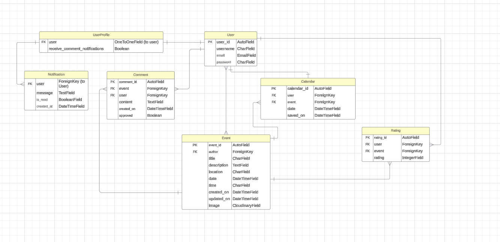

## UserProfile
- **Fields**: 
  - `user`: A `OneToOneField` linking to Django's built-in `User` model, allowing extended attributes for each user.
  - `receive_comment_notifications`: A `BooleanField` that determines if the user should receive notifications for new comments on their events.

## User
- **Fields**: 
  - `user_id`: Primary key, an auto-incrementing ID.
  - `username`, `email`, `password`: Basic fields provided by Django’s user model for authentication and account management.

## Event
- **Fields**:
  - `event_id`: Primary key for each event.
  - `author`: A `ForeignKey` to the `User` model, representing the user who created the event.
  - `title`, `description`, `location`: Essential fields to describe the event.
  - `start_date`, `end_date`, `start_time`, `end_time`: Fields managing the schedule of the event.
  - `image`: An image field using Cloudinary for event images.
  - `status`: A field that stores the publication status of the event.
  
- **Relationships**: 
  - An event is related to a user via the `author` field. It also connects to other models like `Comment`, `Rating`, and `Calendar` for further user interactions.

## Calendar
- **Fields**:
  - `calendar_id`: Primary key for each calendar entry.
  - `user`: A `ForeignKey` linking the calendar to a specific user.
  - `event`: A `ForeignKey` linking the saved event to the calendar.
  - `date`: The date the event is saved.
  - `saved_on`: The timestamp when the event was added to the user's calendar.

## Comment
- **Fields**:
  - `comment_id`: Primary key for each comment.
  - `event`: A `ForeignKey` linking the comment to the relevant event.
  - `user`: A `ForeignKey` linking the comment to the user who posted it.
  - `content`: The text content of the comment.
  - `created_on`: Timestamp of when the comment was created.
  - `approved`: A boolean flag to moderate comments before they are visible.

## Rating
- **Fields**:
  - `rating_id`: Primary key for each rating.
  - `user`: A `ForeignKey` linking the rating to the user.
  - `event`: A `ForeignKey` linking the rating to the event being rated.
  - `rating`: An integer field representing the rating given by the user to the event.

## Notification
- **Fields**:
  - `user`: A `ForeignKey` linking the notification to a specific user.
  - `message`: The content of the notification.
  - `is_read`: A boolean flag to mark if the notification has been read by the user.
  - `created_at`: A timestamp indicating when the notification was created.

The model structure enables users to interact with events efficiently, allowing for event creation, commenting, saving events to their calendar, and rating events. Notifications ensure users are updated with relevant actions on their events or interactions with other users.

The relationships between models also allow for seamless data queries, ensuring efficient access to the right information based on user activity.

## General Features

### Frameworks and Tools

The website uses Django to manage the core functionalities of the site such as user authentication, event management, and database handling. Using Django’s built-in tools like the admin interface and Django ORM helped to streamline development and make data handling more efficient.

The frontend uses HTML, Javascript and Bootstrap for layout and design, with additional custom CSS to tailor the visual appearance of elements. The combination of Bootstrap and custom CSS ensures a responsive and user-friendly design that adapts across various devices, meeting the needs of both mobile and desktop users.

For media management, Cloudinary is used to handle user-uploaded images, ensuring efficient storage and delivery of images while maintaining high performance.

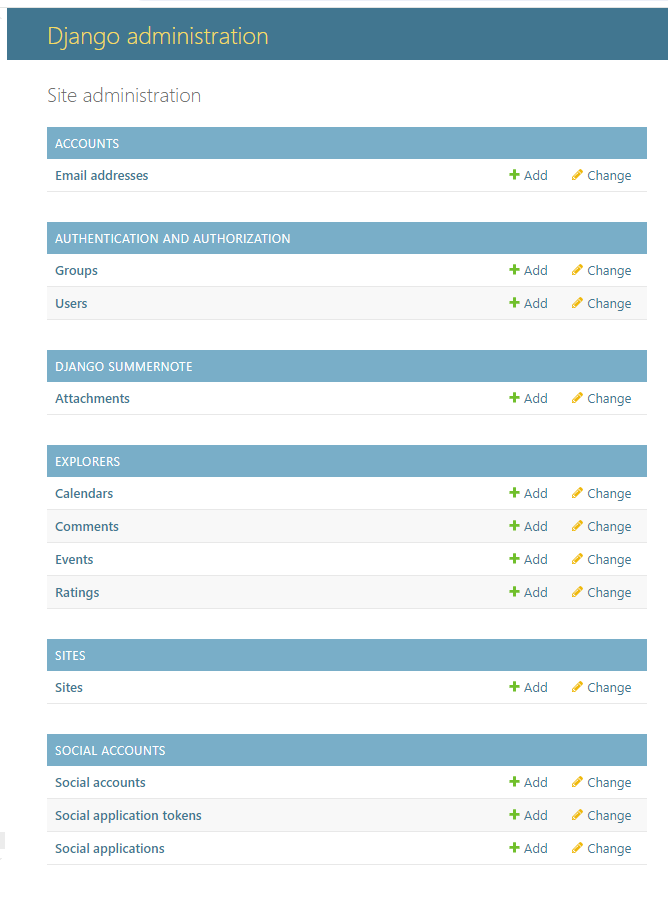

### Responsive Design
The website is fully responsive, using Bootstrap’s grid system and media queries to ensure a smooth user experience across devices. A mobile-first design approach was followed to prioritise accessibility on smaller screens.

#### Key Breakpoints
- **Small Devices (Max-width: 768px)**: On small devices like smartphones, content is stacked vertically. The navigation bar collapses into a hamburger menu, ensuring easy access to all links without crowding the screen.
- **Medium Devices (Max-width: 992px)**: Layouts expand slightly, with more space between form fields, cards, and navigation elements. This ensures a clean presentation on tablets.
- **Large Devices (Min-width: 992px)**: On larger screens, like desktops, the layout makes full use of the available space. Elements are spread out for a comfortable reading experience, and form inputs are larger for better usability.

### Navigation
- **Dynamic Navbar**: The site features a consistent navigation bar that adapts to different screen sizes. For mobile users, the navbar collapses into a dropdown menu. The navbar changes based on the user’s authentication status. Unauthenticated users see links to "Sign Up" and "Login," while authenticated users have access to personalised options relating to their account.
- **Dropdown Menus**: The "Events" link includes a dropdown that contains options like "Browse Events" and "Add Event." This allows users to quickly navigate between different sections without needing to return to the home page.navigation.

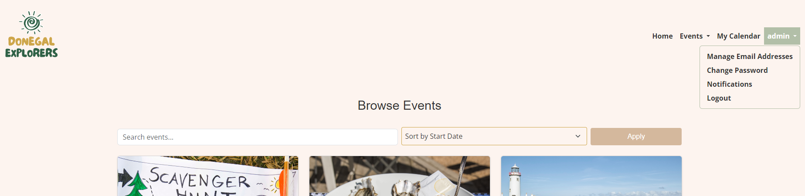

This dynamic content helps improve navigation by ensuring users only see relevant options based on their logged-in state. User stories like "As a user, I want easy access to event management tools" directly informed the development of this feature.

### Logo and Responsive Resizing in Navbar

The logo for **Donegal Explorers** is featured prominently in the navigation bar across all pages of the site, serving as a central branding element. It provides users with an immediate visual association to the platform. The logo is designed to resize responsively based on the screen size, ensuring that it remains clear and proportionate on all devices. 

- **On larger screens** (e.g., desktops), the logo is displayed at a more prominent size, reinforcing the brand presence. Its dimensions are set to ensure it doesn't overshadow the navigation links but maintains a strong visual presence.
- **On smaller screens** (e.g., tablets and mobile devices), the logo adjusts to a smaller size to make optimal use of the limited screen space. This resizing ensures the navigation bar remains uncluttered and that users can still easily navigate through the site without obstruction.

The resizing of the logo is handled using both CSS and Bootstrap's responsive classes to maintain consistency across breakpoints.

### Favicon

A custom favicon is used on all pages of the website to enhance brand identity and improve user experience. This small yet significant detail ensures that users can easily identify the Donegal Explorers site even when they have multiple browser tabs open. The favicon visually represents the platform and contributes to the professional feel of the site. 

It is particularly useful when users are switching between tabs, as it provides quick visual feedback about the Donegal Explorers website, even when minimised to a small icon. The favicon is consistent with the logo and brand color scheme, maintaining uniformity across various visual elements of the site.

### Footer

The footer is present on all pages and contains links to the site’s social media platforms, encouraging users to connect with Donegal Explorers on social platforms. The footer also ensures consistency across all pages by maintaining uniform branding and providing quick access to external resources.


### Social Media Integration

Social media icons are prominently featured in the footer, allowing users to easily connect with Donegal Explorers on various platforms. These icons link to the respective social media pages, opening in a new browser tab to ensure users remain engaged with the site while exploring the external content.

- **Font Awesome Icons**: The icons are derived from the Font Awesome library and are styled to match the site's branding. Their colors change on hover, providing a subtle yet effective interaction for users and drawing attention to these external resources.
  
- **Responsiveness**: The social media links are fully responsive, adapting their size and placement based on the device.

This integration not only enhances the site's interactivity but also encourages users to become part of a wider community of explorers, connecting through platforms like Facebook, Instagram, and Twitter. These links play a key role in building the social presence of Donegal Explorers, fostering engagement beyond the website.

### Accessibility
Ensuring accessibility was a key goal throughout development. The project adheres to WCAG standards to make the platform usable by a wide range of users, including those with disabilities. Key features include: 

- **Semantic HTML**: Elements such as `<header>`, `<nav>`, and `<footer>` were used to structure content logically, improving navigation for users relying on screen readers.
- **ARIA Labels**: Interactive components, such as buttons and links, are accompanied by descriptive ARIA labels to ensure users with assistive technologies can easily interact with the platform.
- **Keyboard Navigation**: The site is fully navigable via keyboard, allowing users to tab through forms, buttons, and links without needing a mouse.

## Page-Specific Features

### Home Page Features

- **Hero Section**: The hero section greets users with a large banner image showcasing the beauty of Donegal and a prominent call-to-action message encouraging users to explore family adventures. A clear and accessible "Sign Up" button immediately directs users to create an account and start participating in events. This section is designed to be fully responsive, adapting to different screen sizes using Bootstrap's responsive classes and custom CSS, ensuring the layout remains visually appealing and easy to interact with on all devices. User stories, like "As a new user, I want to quickly understand what Donegal Explorers offers," were used to inform this design.

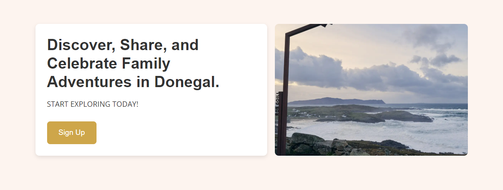

- **Welcome Section**: The welcome section introduces Donegal Explorers to users, providing an overview of what the platform offers, including event browsing, saving events, and family activities in Donegal. It uses Bootstrap’s grid system to align text centrally, making it visually appealing and easy to read on all screen sizes. This section acts as a key narrative element, guiding new users through the site’s purpose and encouraging further exploration.

- **Features Section: Event Interactions**: Below the welcome section, users are presented with three interactive cards that serve as quick links to the main features of the website:

1. **Browse Events**: This card leads users to the event browsing page, allowing them to explore upcoming and family-friendly events across Donegal. It includes an icon representing event exploration and a short description that encourages users to engage.

2. **Add Event**: The second card is aimed at event organisers and allows users to quickly access the event submission form, enabling them to add their events to the platform. Like the "Browse Events" card, it includes an icon and a brief description to make the purpose clear.

3. **View Calendar**: The third card directs users to their personal calendar, where they can view saved events in a convenient month-by-month format. The calendar helps users keep track of events they've registered for or marked as favorites.

Each card is styled using Bootstrap’s card components, combined with custom CSS for hover effects and shadows to give them a modern, clickable feel. The cards are displayed in a responsive grid, ensuring they remain proportionate and aligned on different screen sizes, from mobile to desktop. 

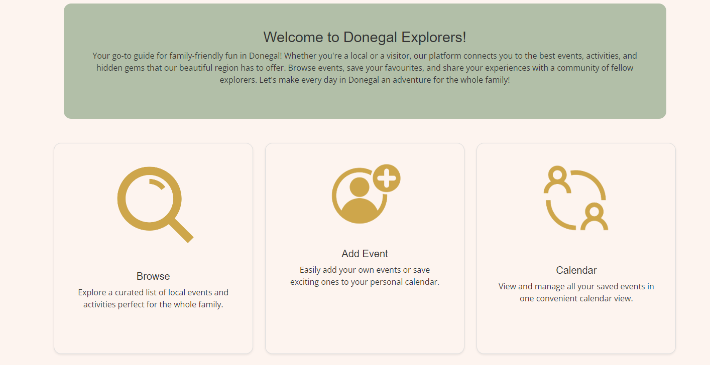

- **Upcoming Events**: The Upcoming Events section on the home page pulls data from the database and displays the next three events, allowing users to quickly see what’s happening in Donegal. This is a dynamic feature that updates based on the events stored in the database, ensuring the site remains current.

The events are displayed in a grid format, with each event showing a thumbnail image, the event title, and its start date. This section encourages users to engage with the platform by showing relevant and timely information.


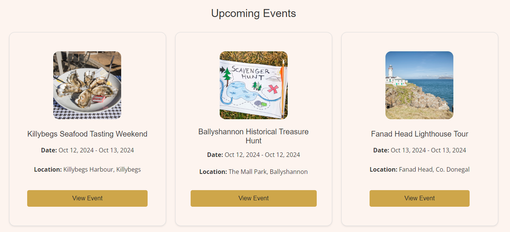


### Event Management Features

#### Event Model and Event Form

The Event model stores all the information related to an event, including its title, description, start date, end date, location, and an image. The model is the backbone for all event-related functionalities, from displaying events to allowing users to create new ones.

The EventForm allows users to submit new events. It’s built using Django’s ModelForm class, which automatically generates the form fields based on the Event model’s attributes. This ensures consistency between the data model and the user interface.

Form validation, such as ensuring the end date is not earlier than the start date, is handled by custom logic in the form’s clean method. This prevents users from submitting incorrect data, improving overall data integrity.

#### Browse Events

The Browse Events page allows users to search for and explore events in Donegal. Events can be sorted by date, location, or title, providing flexibility for users to find what they’re looking for. The filtering options align with user needs ensuring that they can easily navigate through the available options.

This page pulls data from the Event model and uses Django’s ORM to filter and sort events based on user input. The search functionality is powered by a basic text filter that checks the event title and description for matches, while the sorting options allow users to sort by various attributes.

The key features include:

- **Search and Sorting**: Users can search for events by keywords and sort them by date, title, or location, using form controls at the top of the page. The search bar dynamically filters events based on the user's input, and sorting options allow users to quickly find events that match their preferences.

- **Event Cards**: Each event is displayed in a Bootstrap card, featuring the event title, location, date, and a short description. Cards include a “Read More” button that directs users to the detailed event page.

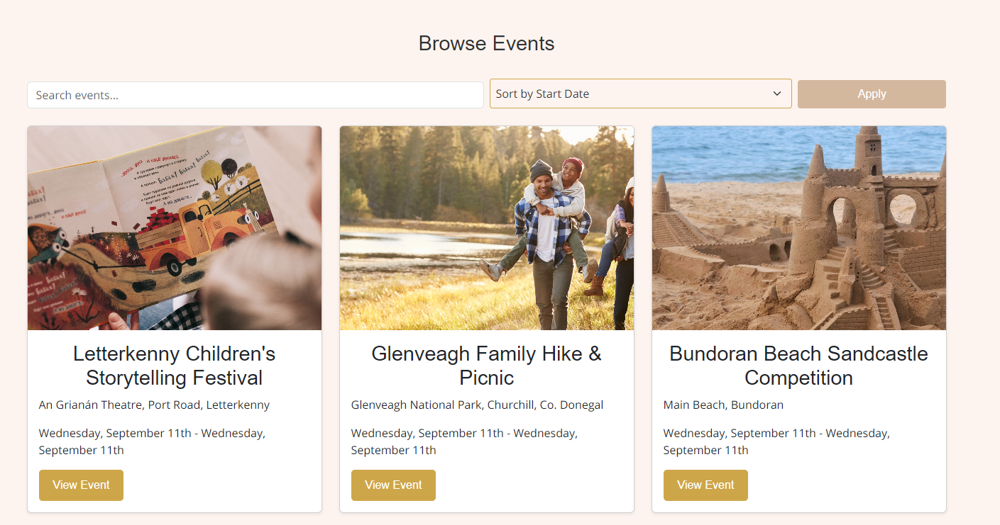

#### Event Detail Pages

The individual **Event Detail** pages provide comprehensive information about each event. Features include:

- **Detailed Event Information**: Users can see the full event details, including location, start/end date and time, and a more detailed description. Event images (if available) are displayed in a responsive format at the top of the page. If no image has been added a placeholder image is shown.

- **Comments and Ratings**: Logged-in users can leave comments about the event or add a rating. Comments are displayed in a section below the event details, with the most recent comments displayed first. The CommentForm uses the Comment model, which includes fields such as content, user, and event. Users must be logged in to see the comment form, which is validated to ensure that no blank comments are submitted. When a user submits a comment, the system validates the form and associates the comment with the logged-in user and the event.

Users can edit their comments after submitting them, allowing for corrections or updates to their content. Next to each comment that a user has posted, there is an Edit button (visible only to the comment author and admins). When clicked, the button redirects the user to the edit comment page, where they can update their comment. The form for editing comments includes the same validation as the initial comment form, ensuring that the updated content is valid before being saved. Users can also delete comments they’ve submitted, providing them control over their content.

- **Save to Calendar**: Logged-in users can save the event to their personal calendar with a single click. A button labeled “Save to My Calendar” is available for quick access. Once an event is saved to the users calendar, a button is available to 'remove from calendar'.

- **Edit and Delete Event**: If an event has been added by a user, it is possible for them to edit or delete the event via buttons within the individual event detail page for ease of management.

- **Ratings**: The Ratings system allows authenticated users to rate events. This feature provides valuable feedback to event organizers and helps other users gauge the popularity or quality of an event. Users can only rate each event once, this is enforced through a unique constraint in the Rating model, which ties the rating to the user and the event. Each event page displays the average rating based on all user submissions. This is calculated dynamically using the Rating model, which stores individual ratings for each user and event. Once a user selects their rating and submits it, the form is validated to ensure that the rating is within the acceptable range (e.g., between 1 and 5 stars). The rating is then saved to the database and associated with both the user and the event.

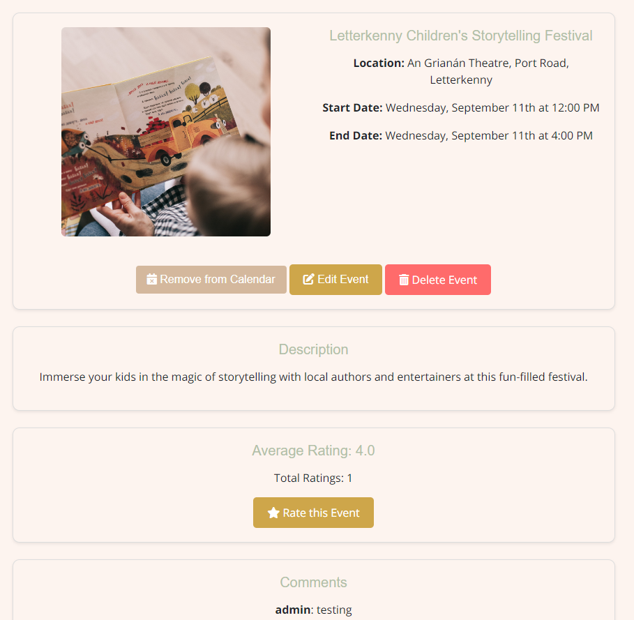

#### My Events

The My Events page is designed specifically for authenticated users to manage the events they have created. This page allows users to view quick details, edit, and delete their events, and it also displays detailed information about each event in a card format, making it easy for users to interact with and manage their submissions.

This page is linked directly to the Event model, which stores all of the event data, and the backend filters the events so that each user only sees events they have created. The filtering is implemented by querying the Event model for the currently logged-in user's author field, ensuring that no other user's events appear in this view. 

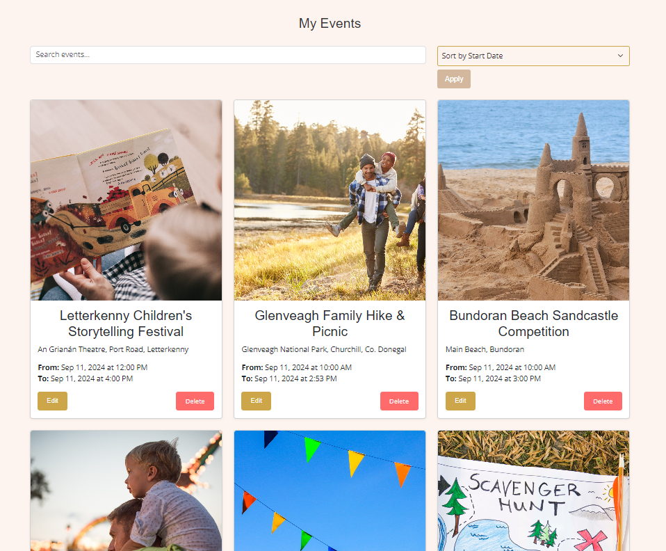

- **Event Card Display**: Each event the user has created is displayed in a Bootstrap card format, which presents key details in a concise and visually appealing way. The card includes:

Event Title: Displayed prominently at the top of the card to allow quick identification of each event.
Event Location: The location where the event will take place, so users can verify or update this if necessary.
Event Date and Time:
Start Date & Time: Displays when the event will begin.
End Date & Time: Displays when the event will end.

These cards ensure that users can quickly get an overview of the events they have created, while also providing an intuitive interface for managing them.

- **Edit and Delete Buttons**: For each event, two buttons are displayed in the card’s footer to allow users to manage their event: Edit and Delete.

Edit Button:

Clicking this button takes the user to the edit event form, where they can modify details about their event, such as the title, description, dates, and times. This functionality is directly tied to the EventForm, and the fields displayed for editing are the same fields used when initially creating the event. The user can update any aspect of the event, and the form validation ensures that the new data is correct, displaying helpful error messages if needed (e.g., if the end date is before the start date).
The form is styled using crispy forms to ensure consistent and user-friendly layouts.

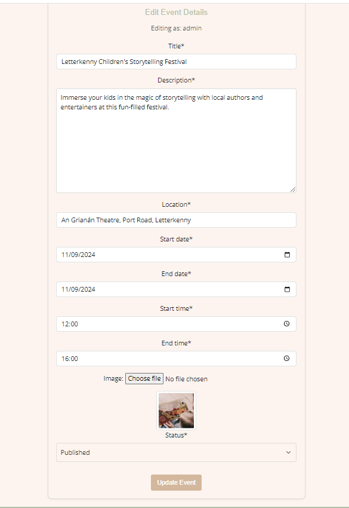

Delete Button:

Clicking the delete button will trigger a confirmation modal or redirect the user to a confirmation page that asks the user to confirm whether they truly want to delete the event. This ensures that events are not accidentally deleted without confirmation.
The confirmation page contains a message "Are you sure you want to delete this event?" with a confirmation button, giving the user a final opportunity to reconsider their action.

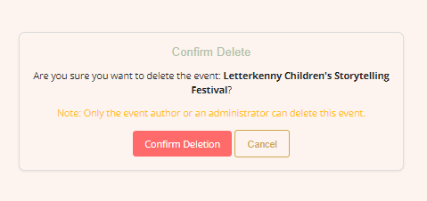


For admin users, they also have access to the same buttons for any event on the platform, not just their own. This means an admin can edit or delete any event, which is useful for platform management. Admin privileges are enforced using Django’s built-in permission system, ensuring only users with appropriate roles have access to all events.

#### Add an Event

The Add Event page allows authenticated users to create new events that will be displayed on the platform. This page plays a crucial role in the site's functionality, as it enables event organisers to contribute by adding events, which can then be browsed by other users. The form on this page is directly tied to the Event model and uses the EventForm to collect the necessary information. The Add Event form is built using Django’s ModelForm, specifically the EventForm, which automatically generates fields based on the fields specified in the Event model. This ensures that the form remains consistent with the data structure and that any changes to the model are reflected in the form.

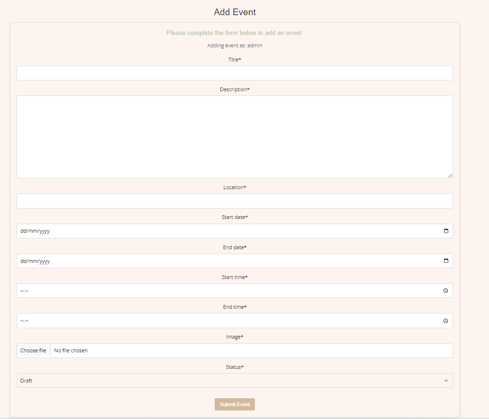

The fields required for creating an event include:

Title: A text input for the event’s title. This field is required and is limited in length to ensure titles are concise and meaningful. Placeholder text "Event Title" helps guide users in filling out this field.

Description: A multi-line text area for event details. This field is also required and gives the user the opportunity to describe the event in depth.

Location: A text input for the event’s location, where users can specify where the event will take place. It includes a placeholder of "Event Location" to guide the user.

Start Date and End Date: Date pickers allow users to select the event’s start and end dates. The date fields are integrated with a calendar picker for ease of use, minimising errors with date formats.

Start Time and End Time: Time pickers allow users to select the start and end times for their event. The form ensures that end times cannot precede start times, which is validated in the form logic.

Image: An optional file upload field where users can upload an image representing the event. This adds visual appeal to the event when displayed on the site. If no image is uploaded, a default placeholder image is used when displaying the event in lists and details.

Status: A dropdown menu that lets users specify whether the event is currently Published or a Draft. This allows users to work on an event without making it public until it’s ready.

The Submit button is located at the bottom of the form and styled using a Bootstrap button class for consistency with the rest of the site's design. When the form is successfully submitted, the event is saved to the database, and the user is redirected to a confirmation page or to the event detail page where they can review the event they just created.

Only authenticated users can access the Add Event page. If an unauthenticated user tries to access this page, they are redirected to the login page, and a message is displayed encouraging them to log in or sign up before adding an event.

This is enforced through Django’s login_required decorator, which ensures that non-authenticated users are redirected to the login page when attempting to access the page.

- **Form Validation and Error Handling**: The EventForm includes built-in validation to ensure that the data submitted by users is correct and logical. Validation checks include:

Required Fields: Fields such as Title, Description, Location, Start Date, and Start Time are mandatory, ensuring that the event has all the necessary information.

Date Validation: The form checks that the End Date is not before the Start Date, and if the event starts and ends on the same day, the End Time must be after the Start Time. This logic is handled within the clean method of the form.

If validation fails, error messages are displayed at the top of the form and inline with the fields that caused the error. These error messages help guide users in correcting their input. For example, if the user tries to submit an event with an end date earlier than the start date, the message "End date must be after the start date" will be displayed.

- **User Feedback and Confirmation**:

Upon successful submission of the event, the user is shown a success message that confirms their event has been added, as shown in the image below. All error messages are prominently positioned both at the top of the form and next to the specific fields that need correction, making it clear what needs to be fixed before the form can be resubmitted.


#### My Calendar

The My Calendar page is a key feature for registered users, enabling them to manage and view events they have saved to their personal calendar. This feature focuses on user engagement, allowing users to track upcoming events and visualise their schedule in an intuitive and organied manner. The page directly ties into the Calendar and Event models and aligns with several user stories. Only authenticated users can access the My Calendar page. This is enforced using Django's LoginRequiredMixin, ensuring that non-logged-in users are redirected to the login page.

The My Calendar page is structured to show events saved by the user in a monthly format, offering a clear view of upcoming events. The layout allows users to see events organised by date, making it easy to navigate through their saved events for the current month, while also giving them control to browse future months. The page is highly responsive and designed to adapt to various screen sizes for both mobile and desktop users.

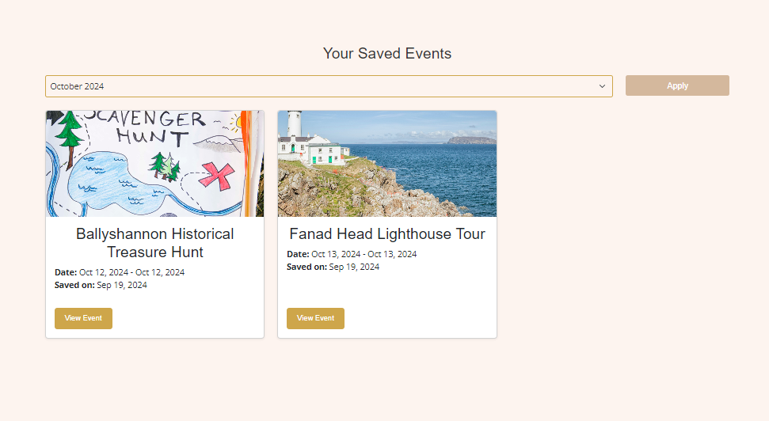

These events are shown as cards that contain the following information:

Event Image: If the event has an associated image, it is displayed as a thumbnail at the top of the card.
Event Title: The title of the event is presented prominently at the top of the card.
Event Date and Time: The date range and time of the event are clearly displayed.
Location: The event location is included.
View Event Button: A link to view the event detai page is available in each card, which provides options to remove the event from the calendar.

The Calendar model acts as an intermediary between the Event model and the user. When a user saves an event, an entry is created in the Calendar model with references to both the user and the event. This relationship ensures that users only see events they have personally saved, and each user’s calendar is entirely unique to them.

When a user adds or removes events from their calendar, feedback is provided in the form of the available buttons on the page, which change dynamically to 'Remove from Calendar' or 'Save to Calendar'.

### User Account Features

The User Account Features are key components for managing user interactions and preferences within the Donegal Explorers platform. These features are accessible through a dropdown menu in the navbar, which becomes visible when a user is authenticated. This section focuses on the user account management options available to registered users, detailing the features for managing email addresses, changing passwords, notifications, and logging out.

These features are not just functional but are also designed to offer users a seamless experience in managing their accounts. The dropdown interface is consistent across all devices and is designed with accessibility in mind.

- **Dropdown Menu for User Account Management**: 

Once a user logs in, the navbar automatically updates to display the username with a dropdown arrow. This dropdown provides easy access to several account management features. The user account dropdown includes the following options:

Manage Email Addresses
Change Password
Notifications
Logout

These features are connected to the Django authentication system and integrated with custom templates and views to enhance the user experience.

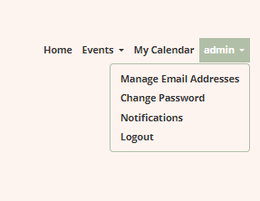

- **Manage Email Addresses**:

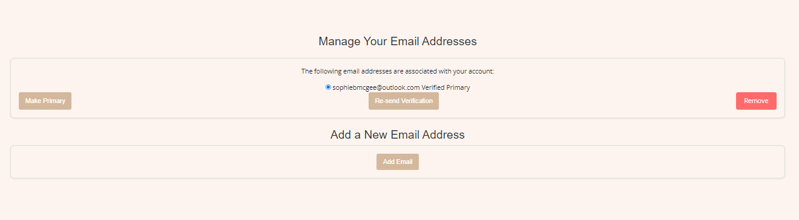

The Manage Email Addresses feature allows users to manage the email addresses associated with their account. This page gives users the ability to add, remove, or change the primary email address used for notifications, account recovery, and communications.

This feature directly ties into the allauth email management system, which handles email verifications and updates. The templates and views used for email management include:

Email Management Template (email.html): This template is where users can view their current email addresses and take actions like adding a new one, verifying an unverified email, or setting an email as primary.

Email Verification Templates: The following templates are used to handle the verification process:

email_confirm.html: This template is used when users need to confirm a newly added email address. A verification link is sent to the user's new email, and they are redirected here to complete the process.

email_verification_sent.html: This confirmation page informs users that a verification email has been sent and they must check their inbox to complete the verification.

- **Change Password**:

The Change Password option allows users to change their current password securely. This is essential for account security and aligns with best practices for password management. When users select this option, they are taken to a custom template where they can enter their current password and set a new one.

The relevant templates and flows are as follows:

Change Password Template (password_change.html): This template provides a form for users to input their current password and choose a new one. It's styled with Bootstrap to ensure a user-friendly experience. The form includes fields for:

Current Password: Users must confirm their identity by entering their current password.
New Password: The password must meet security criteria, such as minimum length and character variety.
Confirm New Password: Users re-enter the new password to ensure it matches.
Validation errors, such as mismatched passwords or incorrect current passwords, are displayed with custom error messages using Django’s built-in form validation.

Success Message: Upon successfully changing the password, users are shown a custom success message, confirming the update. This success message is handled using Django’s messages framework and appears on the same page to inform the user that the password has been successfully changed.

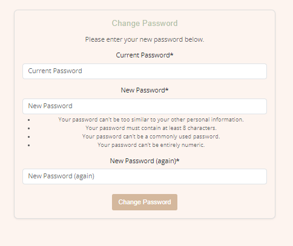

- **Notifications**:

The Notifications page allows users to manage how they receive alerts and notifications related to events and account updates. This feature provides a centralised way for users to adjust their preferences for receiving email notifications about new events, updates, or reminders. In addition, 

The notifications.html template provides users with a form to manage these preferences, linking to the NotificationPreferencesForm and allowing users to opt in or out of notifications.

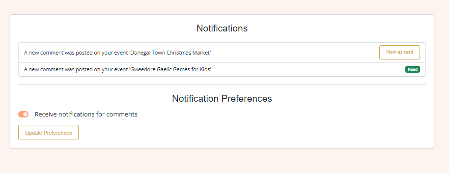

The UserProfile model extends the default Django User model to include additional features specific to Donegal Explorers. This model plays a critical role in managing user-related data beyond the basic authentication details provided by Django’s default user model. The UserProfile model includes fields that allow users to manage their notification preferences. This is particularly useful for event-related updates, such as reminders for saved events or notifications when events they are interested in are updated or cancelled, which could be useful for developing future features. 

- **Signup**:

The Signup page is the entry point for new users to create an account on Donegal Explorers. The design and development of this page are carefully crafted to ensure a smooth registration process, with a focus on clarity, simplicity, and responsiveness. The page leverages Bootstrap for styling and layout, ensuring that it is mobile-friendly and accessible on all devices.

Key Features:
Form Structure: The signup form includes fields for email, username, and password, all of which are validated to ensure the correct format and security standards are followed. The form fields are rendered using the crispy-forms package for enhanced styling and responsiveness.

Email Verification: After successful registration, users are required to verify their email address before gaining access to key site features. This process is integrated into Django's allauth email confirmation workflow. When a user submits the signup form, an email with a confirmation link is automatically sent to the provided email address. The template for this email is located in templates/account/email_confirm.html, which was customised for branding consistency and user-friendly messaging.

Email Verification Template: This email includes a clear, branded message informing users of the next steps in the verification process, along with a prominent verification link. The content ensures the user experience is smooth, avoiding any confusion during account activation.

Error Handling:
Validation Errors: If any form fields are left incomplete or do not meet the specified criteria (e.g., an invalid email format or weak password), Django’s form validation automatically provides error messages directly on the signup form. These are displayed in a consistent, user-friendly format that aligns with the overall design of the platform.

Non-Field Errors: If there are any additional issues during registration (such as a duplicate username or email), these errors are displayed at the top of the form, ensuring users can quickly resolve any issues preventing them from signing up.

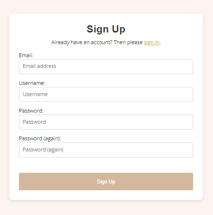

- **Login and Logout**:

The Logout option allows users to securely log out of their account, ensuring that their session is closed and no one else can access their account if they leave their device unattended. This functionality is handled by Django’s built-in logout view, but it’s seamlessly integrated into the user experience with custom messaging and redirection. Upon logging out, users are redirected to the homepage and shown a success message confirming they’ve logged out.

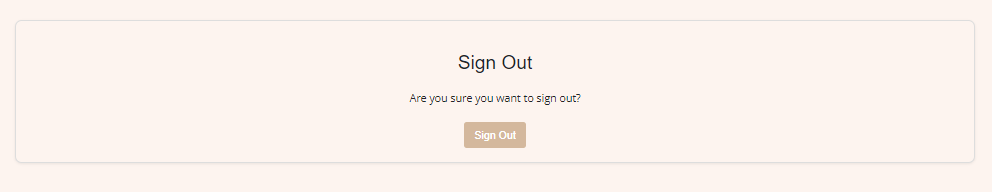

The Login page allows existing users to access their Donegal Explorers account securely. Like the signup page, it is built using Django allauth and Bootstrap to ensure a seamless, user-friendly interface.

Key Features:
Form Layout: The login form includes fields for email/username and password. The form fields are also styled using crispy-forms, maintaining design consistency across the platform.

Error Handling: If incorrect login credentials are entered, the user is shown a clear error message indicating that the credentials are invalid. This message is displayed in an alert at the top of the form, guiding the user to recheck their details.

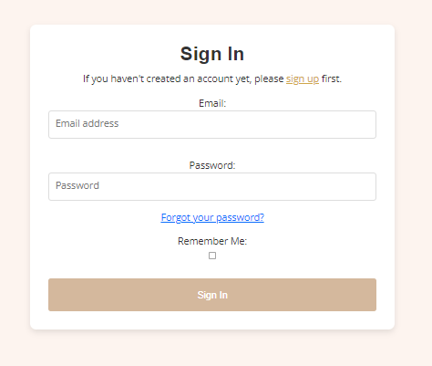

- **Email Management**:

TXT files play a crucial role in managing the content of emails sent to users during various stages of the user lifecycle, such as account creation, password resets, and email verification. These templates were customised to align with the Donegal Explorers brand, ensuring consistent communication across all touchpoints.

Email Templates for User Account Management:
The following TXT files were customised for Donegal Explorers and are located in the templates/account/ directory:

email_confirmation_message.txt: This file contains the content that is sent to users when they sign up and need to confirm their email address. The content includes a greeting, a message thanking the user for joining Donegal Explorers, and a confirmation link that the user must click to activate their account. It also contains a fallback message in case the link doesn’t work, instructing the user on how to manually activate their account.

password_reset_key_message.txt: This file manages the content sent to users when they request a password reset. It includes a reset link, which when clicked, takes users to the password reset page where they can create a new password. The email is structured to be clear and user-friendly, with instructions on what to do if the user didn’t request a password reset, ensuring security.

email_verification_sent.html: After a user submits their email for verification, they are redirected to a confirmation page. This page is styled to reflect the Donegal Explorers brand, reinforcing the email verification process and providing users with an easy-to-follow process for verifying their email.

How These Files Tie into User Actions:
Signup Process: Once a user signs up, Django’s allauth system automatically uses the email_confirmation_message.txt file to send an email to the user, containing a confirmation link. The system looks for this file in the account templates directory and sends it as part of the account verification process.

Password Reset: If a user forgets their password, they can use the Forgot Password feature on the login page. Once they submit their email, Django’s allauth uses the password_reset_key_message.txt to send an email with instructions and a reset link. This ensures that the user can securely reset their password without any involvement from the admin side.

Account Verification: The email_verification_sent.html file is rendered after users submit their email for verification. It contains a branded message letting users know that they will receive an email with a verification link. This page is essential for ensuring users understand the next steps and helps guide them through the final stages of account setup.

- **Account Recovery**:

Password Reset: If a user forgets their password, they can easily reset it by clicking the "Forgot Password?" link on the login page. This link directs them to a password recovery page, where they can enter their email address to receive a password reset link. The password reset email is managed by Django allauth, and the email template is located at templates/account/password_reset.html. This email includes a clear link for resetting the password, ensuring that the user can regain access quickly and securely.

Password Reset Template: The password reset email template has been customised to match the branding of the platform and provide clear instructions. The link within the email takes the user to a secure password reset form where they can enter a new password.

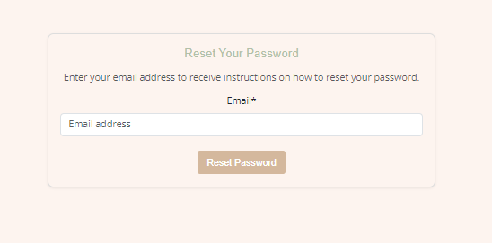

- **Security Features**:

Email Confirmation: Users cannot access certain areas of the site (e.g., adding events, managing the calendar) until their email address is verified. This ensures that only legitimate users can access restricted features, safeguarding the platform against unauthorized use.

Password Security: Django's built-in password hashing ensures that user passwords are securely stored. Additionally, the allauth package enforces strong password policies, requiring users to create secure passwords that include a mix of characters.

### 404 Page

The 404 page is a custom error page designed to provide a user-friendly experience when users attempt to visit a broken or non-existent URL on the Donegal Explorers platform.

Key Features:
Custom Message: When users attempt to visit a URL that doesn’t exist, the platform displays a custom error message, informing them that the page they are looking for can’t be found.
Consistent Design: The page maintains the visual identity of the site by using the same layout, color scheme, and typography. This ensures that even in error states, users feel like they are still on the Donegal Explorers platform.
Call to Action: A clear button is presented to redirect users back to the homepage. This helps guide users back to a useful part of the site, reducing frustration.
Site Navigation: The standard navigation bar and footer are still present on the 404 page, ensuring users can easily navigate to other sections of the site if needed.

### Authentication

Authentication is handled using Django’s allauth package, which simplifies the login, signup, and password management process. The system is fully integrated with Django’s user model, allowing for a seamless experience when signing up or logging in.

When users log in, they gain access to features like My Events and My Calendar, and the navigation bar dynamically updates to reflect their authenticated state.

### Future Features

While the current implementation of Donegal Explorers offers a robust platform for users to explore, manage, and participate in events across Donegal, there are several future features and enhancements planned to further improve the functionality, user experience, and scalability of the platform.

1. Enhanced User Profiles
User Badges and Achievements: Introducing a badge system that rewards users for certain actions, such as attending a specific number of events, adding events, or consistently providing feedback. This gamification element will encourage more engagement from users.
Profile Customisation: Expanding user profile options to include profile pictures, bios, and the ability to mark favorite events and categories.
Event History and Analytics: Users will be able to view their event history, track how many events they’ve attended or added, and analyze their event preferences based on data.

2. Event Recommendations
Personalised Event Suggestions: Building a recommendation engine that suggests events based on a user’s event attendance history, preferences, and ratings. The algorithm will leverage user ratings, interests, and geographic location to provide a tailored list of upcoming events.
Collaborative Filtering: Implementing machine learning models that allow users to see events popular with users who have similar interests or event preferences.

3. Social Features and Community Building
Friendships and Event Sharing: Users will be able to add friends, share events directly with them, and collaborate on planning event attendance.
Community Chat and Forums: Creating forums and chat features where users can discuss upcoming events, share tips about Donegal, and connect with other users. This will foster a greater sense of community around family-friendly activities in Donegal.
Public Event Reviews and Comments: Expanding the comments system to allow for public reviews that other users can upvote or mark as helpful. These reviews will offer a more detailed insight into the event experience.

4. Advanced Notifications System
Push Notifications: Adding browser and mobile push notifications for users to receive updates about upcoming events they’ve saved, reminders for events they plan to attend, or new event categories they may be interested in.
Advanced Notification Preferences: Enabling users to customise their notification preferences even further, allowing for options like daily summaries of upcoming events or instant notifications for new event postings in their area.

5. Event Ticketing and Payment Integration
Ticket Sales: Allowing event organisers to sell tickets directly through the platform. Users will be able to purchase tickets securely through integrated payment gateways like Stripe or PayPal.

6. Event Categories and Filtering
Advanced Filters: Adding more detailed filtering options, such as event price range, event age suitability, or accessibility features.
Event Categories Expansion: Further expanding the event categories and tags, allowing users to quickly find niche events that suit their needs, such as eco-friendly events, educational workshops, or outdoor activities.
Saved Filters: Users will be able to save their filter preferences for quick access in future searches, streamlining the browsing experience.

7. Organiser Tools and Event Analytics
Event Performance Dashboard: Offering event organizers advanced analytics on their event pages, including the number of views, the number of users saving their events, and geographical data of attendees.
Email Campaigns: Integrating email marketing tools that allow event organizers to send email reminders or newsletters directly to users who have saved or attended their past events.
Custom Event Pages: Allowing event organisers to create more detailed, branded event pages with additional media like videos, galleries, and downloadable brochures.

8. Enhanced Search Functionality
Fuzzy Search: Improving the search bar to handle typos or approximate queries, so users can still find events even if they don’t have the exact title or keyword.
Search by Date and Location: Implementing an advanced search filter to allow users to search for events happening on specific dates or within specific regions of Donegal.

9. Admin Dashboard Enhancements
User Management Tools: Expanding the tools available for site admins to manage users, including the ability to view user activity logs, suspend or block accounts, and manage event approvals in bulk.
Event Approval Workflow: Streamlining the event approval process for admins, including notifications when new events are submitted and one-click approval or rejection.

[Back to top](<#contents>)

# Technologies Used

Donegal Explorers was built using a range of modern technologies and tools to ensure the application is robust, scalable, and user-friendly. Below is a breakdown of the primary technologies and how they have been applied throughout the project.

## 1. **Django (Python Framework)**
   - **Django** is the core backend framework used to build Donegal Explorers. Its powerful features for rapid development and clean design made it an ideal choice for this project.
   - The **Django ORM (Object Relational Mapping)** was used to manage the database, allowing for efficient handling of models like `Event`, `Calendar`, `Rating`, and `UserProfile`.
   - **Django’s URL routing** was employed to manage page navigation and ensure RESTful patterns across the application.
   - **Django’s form handling** was essential in building and validating forms for user authentication, event creation, and profile management.

## 2. **Python**
   - As the programming language used to build Django applications, **Python** was integral to Donegal Explorers. Its simplicity and readability ensured clean code structure, especially when working with Django's built-in functionality and custom logic for event management and user authentication.

## 3. **PostgreSQL (Database)**
   - **PostgreSQL** was chosen as the primary relational database management system (RDBMS) for storing data. It offers a powerful and reliable database system, handling all the necessary data such as user accounts, events, and calendar data with ease.
   - With **Django ORM**, interactions between the application and PostgreSQL were simplified, allowing complex queries to be written in Python instead of raw SQL.

## 4. **HTML5**
   - **HTML5** was used for structuring the web pages across the site. Semantic HTML was a priority to ensure accessibility and improve SEO. Key elements such as the `<nav>`, `<header>`, and `<section>` tags were employed to create a well-structured, readable codebase.

## 5. **Bootstrap (CSS Framework)**
   - **Bootstrap** was implemented as the primary front-end framework for responsive design. The grid system, form controls, buttons, and navigation bar components helped speed up the development process, ensuring that the site adapts to different screen sizes efficiently.
   - Custom Bootstrap classes, such as `btn`, `card`, and `form-control`, were integrated with custom CSS to ensure the design remains visually consistent across devices.
   - **Breakpoints** from Bootstrap were used to tailor the layout for mobile, tablet, and desktop views, ensuring a mobile-first approach.

## 6. **CSS (Cascading Style Sheets)**
   - **CSS** was used alongside Bootstrap to further customise the site's styling. Custom styles were applied to various elements like cards, buttons, and forms to maintain a consistent look and feel that aligns with the Donegal Explorers brand.
   - CSS was crucial in ensuring responsiveness, including custom media queries to further refine styles beyond Bootstrap's defaults.
   - Custom hover effects, shadows, and animations were added using CSS to enhance user interactivity.

## 7. **JavaScript (Client-Side Interactivity)**
   - **JavaScript** was employed to handle client-side functionality such as form validation and interactive components like modals, popups, and dynamic filtering of events.
   - Libraries such as **jQuery** were used to simplify DOM manipulation, making it easier to handle user input and create smooth, interactive features.
   - **AJAX** was used in some places to improve the user experience by allowing page elements to update asynchronously without needing a full page reload.

## 8. **Crispy Forms (Django)**
   - **Crispy Forms** was used in conjunction with Django forms to ensure that all forms were rendered with Bootstrap styling by default. This significantly enhanced the appearance of the forms, making them more user-friendly and responsive.

## 9. **Font Awesome**
   - **Font Awesome** was used to incorporate iconography into the design, specifically for the navigation bar, social media icons, and various buttons throughout the site. This helped improve the visual experience and user interaction by providing familiar visual cues.

## 10. **Heroku (Deployment)**
   - **Heroku** was the platform used to deploy Donegal Explorers. Its seamless integration with Django and PostgreSQL allowed for smooth deployment and scalability.
   - Heroku's **Pipelines** feature was used to manage development and production environments, while **Heroku Postgres** was utilized as the primary database during production.

## 11. **Git and GitHub (Version Control)**
   - **Git** was used for version control, allowing tracking of changes and collaborative development
   - **GitHub** served as the central repository for the project, hosting the codebase, issues, and user stories, as well as providing visibility into the agile development process.

## 12. **Gunicorn (WSGI Server)**
   - **Gunicorn** was used as the application server for running Django on Heroku. It helps handle requests and ensures that the application runs efficiently in a production environment.

## 13. **Cloudinary (Media Storage)**
   - **Cloudinary** was used to manage media storage, particularly for handling user-uploaded images such as event photos. This allowed for seamless image uploading, resizing, and management across the application.

## 14. **Django-Allauth**
   - **Django-Allauth** was used to manage user authentication, including registration, login, logout, email verification, and social authentication. This package provided a reliable and secure way to handle user accounts.

## 15. **Django Messages Framework**
   - The **Django Messages Framework** was used to provide user feedback through alerts and notifications, such as when users successfully submit a form or encounter an error. These messages were displayed on the front end using Bootstrap’s alert component.

## 16. **Figma**
   - **Figma** was used during the design phase for wireframing and prototyping. It allowed for quick iterations on the design and layout, ensuring that all stakeholders had a clear vision of how the finished product would look.

## 17. **Canva**
   - **Canva** is a design tool that was used to design the website logo, to source images, and to compare and find the font and to choose colours for the overall colour scheme.

## 17. **Favicon.io**
   - **Favicon** provided a platform for generating the favicon used within the browser tabs.

## 18. **Tinypng**
   - **Tinypng** was used to reduce file size through compression for images throughout the website to improve performance.
---

Each of these technologies contributed to the successful development of Donegal Explorers, ensuring that the platform is both functional and scalable, while offering a seamless user experience. The careful selection of these tools aligns with the project goals, ensuring high performance, security, and ease of use.

[Back to top](<#contents>)

# Deployment

## Heroku Deployment

The Donegal Explorers website was deployed using Heroku, a cloud platform that simplifies the deployment and scaling of applications. Below are the steps taken to successfully deploy the site:

### 1. **Create a Heroku App**
   - Log into your Heroku account. If you don’t have an account, sign up for free.
   - Click the "New" button in the top-right corner and select "Create New App" from the dropdown menu.
   - Enter a unique app name (e.g., `donegal-explorers`) and select your region.
   - Click "Create App" to proceed.

### 2. **Set Up PostgreSQL Database**
   - Navigate to the **Resources** tab in your Heroku app dashboard.
   - In the "Add-ons" search bar, type in `Heroku Postgres` and select it. This will automatically set up the PostgreSQL database and add it to your environment.
   - Copy the `DATABASE_URL` from the **Settings** tab under **Config Vars**—this is required to configure your Django application to connect to the PostgreSQL database.

### 3. **Prepare Environment Variables**
   - In your local project, create an `env.py` file to store sensitive environment variables such as your `SECRET_KEY` and `DATABASE_URL`.
   - In the `env.py` file, add:
     ```python
     import os
     os.environ["DATABASE_URL"] = "<your-database-url>"
     os.environ["SECRET_KEY"] = "<your-secret-key>"
     ```
   - Ensure the `env.py` file is imported in your `settings.py` file to load these variables at runtime.
   - Update `settings.py` to replace the default SQLite configuration with PostgreSQL by setting `DATABASES` to use the `DATABASE_URL` environment variable.

### 4. **Install Dependencies and Prepare Static Files**
   - Run the following commands in your terminal to install necessary dependencies:
     ```bash
     pip install dj-database-url psycopg2
     pip freeze > requirements.txt
     ```
   - Configure static file storage in `settings.py`:
     ```python
     STATIC_URL = '/static/'
     STATIC_ROOT = os.path.join(BASE_DIR, 'staticfiles')
     ```
   - Use **Cloudinary** for storing media files by installing the required library and adding `cloudinary` to your installed apps:
     ```bash
     pip install cloudinary
     ```

### 5. **Configure Django Settings for Production**
   - Ensure the following configurations are in place for production:
     - Set `DEBUG = False`.
     - Update the `ALLOWED_HOSTS` list to include your Heroku app URL and localhost for development:
       ```python
       ALLOWED_HOSTS = ['donegal-explorers.herokuapp.com', 'localhost']
       ```
   - Add the following static files configuration for Cloudinary:
     ```python
     CLOUDINARY_STORAGE = {
         'CLOUD_NAME': '<your-cloud-name>',
         'API_KEY': '<your-api-key>',
         'API_SECRET': '<your-api-secret>',
     }
     DEFAULT_FILE_STORAGE = 'cloudinary_storage.storage.MediaCloudinaryStorage'
     ```
   - Set up a `Procfile` in the root directory to tell Heroku how to run your application:
     ```bash
     web: gunicorn donegal_explorers.wsgi:application
     ```

### 6. **Update Heroku Config Vars**
   - Navigate to the **Settings** tab in your Heroku app.
   - Under **Config Vars**, add the following keys and values:
     - `SECRET_KEY`: Your Django secret key.
     - `DATABASE_URL`: The URL of your PostgreSQL database (automatically added when you set up the database).
     - `CLOUDINARY_URL`: The API URL for your Cloudinary account.
     - `DISABLE_COLLECTSTATIC = 1` (Only needed during initial deployment to prevent Heroku from running collectstatic prematurely).

### 7. **Deploying the Application**
   - In the **Deploy** tab in Heroku, connect your app to your GitHub repository by selecting GitHub as the deployment method.
   - Search for your repository and connect it.
   - In the **Manual Deploy** section, select the branch you want to deploy (e.g., `main` or `master`) and click "Deploy Branch".
   - Optionally, enable automatic deploys to deploy automatically when changes are pushed to the repository.

### 8. **Collect Static Files and Final Configuration**
   - Once the app is deployed, remove the `DISABLE_COLLECTSTATIC` variable in Heroku's Config Vars.
   - Run the following command in your Heroku app's terminal:
     ```bash
     heroku run python manage.py collectstatic --noinput
     ```
   - This will gather all static files for deployment.

### 9. **View the Live Site**
   - Once the deployment is complete, click the "View" button in Heroku to access the live version of your site at `https://<your-app-name>.herokuapp.com`.

## Cloning and Forking this Repository

#### Cloning the Repository
To clone this repository for local development:

1. Navigate to the repository on GitHub.
2. Click the "Code" button and copy the HTTPS or SSH link.
3. Open your terminal or command prompt.
4. Run the following command:
   ```bash
   git clone https://github.com/SophieMcGee/donegalexplorers

To fork the repository and make changes without affecting the original project:

1. Navigate to the repository on GitHub.
2. Click the "Fork" button in the top-right corner.
3. GitHub will create a copy of the repository under your account, which you can clone and modify freely.

# Testing

Extensive testing was completed both during the development and post development with results available to view [here](/testing.md)

# Bugs

## Bugs

During the development of this project, several bugs were encountered and resolved. The following section outlines the key issues that arose, including problems with CSS, template rendering, form validation, and functionality in views and models. Each bug is described in detail, along with the steps taken to diagnose and resolve the issue. By thoroughly addressing these bugs, the project has been enhanced in terms of stability, user experience, and overall functionality. This section highlights the importance of debugging and iteration in the development process, ensuring that the final product meets the intended goals.

### CSS Not Loading Properly
- **Issue:** The header turned blue, and styles weren't applying correctly after moving styles from inline to a CSS file.
- **Resolution:** Ensured the correct path to the stylesheet using Django's `` tag in the `base.html` template. This allowed styles to be properly loaded.

### Footer Styles Not Applied
- **Issue:** Footer styles were not being applied after moving the CSS to a separate file.
- **Resolution:** Confirmed the correct structure and path of CSS. Adjusted the CSS selectors to correctly target footer elements, ensuring consistent styling.

### Incorrect CSS Property Use
- **Issue:** Attempted to set a time field in a Django form that was non-editable.
- **Resolution:** Removed the time field from the form as it was set to auto-populate with `auto_now_add=True` in the model, making it non-editable.

### FieldError in Django Form
- **Issue:** A `FieldError` was raised because the time field, which is auto-populated, was included in the form.
- **Resolution:** Removed the time field from the form in `forms.py` as it was unnecessary and caused the error.

### Django Migration Issues
- **Issue:** Encountered errors when running `makemigrations` due to model and import issues.
- **Resolution:** Corrected the import statements and model definitions to ensure `makemigrations` and `migrate` ran successfully.

### TemplateSyntaxError in Signup Page
- **Issue:** A `TemplateSyntaxError` occurred on the signup page due to a missing block tag (``).
- **Resolution:** Ensured all block tags (e.g., ``, ``) were correctly opened and closed, particularly adding a missing ``.

### ConnectionRefusedError During Login
- **Issue:** A `ConnectionRefusedError` occurred when attempting to log in, indicating the connection to the server was being refused.
- **Resolution:** Ensured the Django server was running and email backend settings were correctly configured, using a console email backend for development.

### Initial Setup Errors
- **Issue:** Configuration errors related to email verification during the initial setup.
- **Resolution:** Corrected the email backend settings in `settings.py` and restarted the server to apply changes.

### Missing or Incorrect Block Tags in Templates
- **Issue:** Errors were due to missing or incorrectly placed Django template tags, leading to rendering issues.
- **Resolution:** Reviewed and corrected all template tags, ensuring proper use of ``, ``, ``, and `` tags.

### Slug Field Addition for Event Model
- **Issue:** The `slug` field was missing, causing issues with user-friendly URLs for events.
- **Resolution:** Added a `slug` field using `AutoSlugField` to the Event model, updated the `EventCreateView` to auto-generate slugs, and ran migrations.

### Errors in urls.py and views.py
- **Issue:** Incorrect imports and usage in `urls.py` and `views.py` caused errors.
- **Resolution:** Corrected imports in `urls.py`, updated URL patterns, and ensured that `SavedEventsView` and other views were correctly defined.

### Error Adding Event Status Field
- **Issue:** A `NameError: name 'EVENT_STATUS_CHOICES' is not defined` occurred when adding an event status field.
- **Resolution:** Defined `EVENT_STATUS_CHOICES` in `models.py` and updated the Event model with a `status` field. Ran migrations to apply the changes.

### Image Display Issues on My Events Page
- **Issue:** Event images were not displaying in the `my_events.html` template.
- **Resolution:** Corrected the Cloudinary image field and template code to ensure images rendered properly.

### Event Editing Permission Issues
- **Issue:** Unauthorised users could access the event editing form.
- **Resolution:** Added permission checks in the `edit_event.html` template to restrict access to event authors or superusers.

### NoReverseMatch Errors in Event Detail Page
- **Issue:** `NoReverseMatch` errors occurred for URLs like `save_event_to_calendar`, `edit_event`, `delete_event`, and `rate_event`.
- **Resolution:** Replaced `event.id` with `event.pk` to correctly pass the event’s primary key for URL resolution.

### Email Verification Page Not Displaying Custom Template
- **Issue:** The email verification page was not displaying the custom `email_verification_sent.html` template.
- **Resolution:** Updated `urls.py` to reference the correct custom template and verified the TEMPLATES configuration in `settings.py`.

### CSS Formatting Not Applied in Heroku Deployment
- **Issue:** CSS was not applied correctly in Heroku after deployment.
- **Resolution:** Configured static file settings, added `WhitenoiseMiddleware`, and ran `collectstatic` to resolve the issue.

### Notification Bug: No Notifications Appearing
- **Issue:** Users were not receiving notifications for event comments.
- **Resolution:** Updated the signal logic to ensure notifications were triggered and displayed in the template.

### Form Field Display Error with `as_crispy_field`
- **Issue:** A `TemplateSyntaxError` occurred due to the use of the `as_crispy_field` filter without the proper installation.
- **Resolution:** Replaced `as_crispy_field` with manual form rendering using Bootstrap classes.

### Large Logo Display in Navbar
- **Issue:** The logo in the navbar appeared too large and disrupted the layout.
- **Resolution:** Adjusted the logo size using `max-width` and `height` properties in the CSS.

### Duplicate UserProfile Creation Error
- **Issue:** Manually creating a user profile resulted in a `UniqueViolation` error.
- **Resolution:** Used `get_or_create()` for profile creation to prevent duplicates.

### Email Notifications Not Being Sent
- **Issue:** Email notifications for event comments were not being sent due to incorrect SMTP configuration.
- **Resolution:** Updated the SMTP settings in `settings.py` to ensure emails were properly sent.

### Dynamic Navbar for Logged-in Users Not Showing Properly
- **Issue:** The dynamic display of the navbar for logged-in users was not working.
- **Resolution:** Updated the navbar rendering logic to show the correct links for authenticated users.

### Event Deletion Confirmation
- **Issue:** No confirmation was prompted before deleting an event.
- **Resolution:** Added a confirmation modal for event deletions.

### Rating Feature: Multiple Submissions
- **Issue:** Users were able to submit multiple ratings for the same event.
- **Resolution:** Added validation to prevent multiple submissions of event ratings.

### Search and Sorting Functionality
- **Issue:** The search and sorting functionality on the event listing page needed refinement.
- **Resolution:** Improved the search and sorting logic in the `BrowseEventsView` and adjusted the UI for a better user experience.

# Credits

Throughout the development of this project, several resources were used to assist with coding, design, and functionality implementation. Below are the key sites and tutorials that provided guidance during the development process:

1. **Django Documentation**  
   - For understanding Django's models, views, and template syntax, as well as handling forms, migrations, and more.
   - [https://docs.djangoproject.com/en/stable/](https://docs.djangoproject.com/en/stable/)

2. **Stack Overflow**  
   - General problem-solving and debugging guidance, including Django-specific issues like migrations, URL routing, and template rendering.
 
3. **Django Crispy Forms**  
   - Helped with implementing better form layouts and customization using the Crispy Forms library.
   - [https://django-crispy-forms.readthedocs.io/en/stable/](https://django-crispy-forms.readthedocs.io/en/stable/)

4. **W3Schools - CSS and HTML**  
   - For basic HTML and CSS syntax and learning how to structure layout and styling for the project.
   - [https://www.w3schools.com/html/](https://www.w3schools.com/html/)  
   - [https://www.w3schools.com/css/](https://www.w3schools.com/css/)

5. **Bootstrap Documentation**  
   - For adding responsive design elements and styling using Bootstrap classes.
   - [https://getbootstrap.com/docs/5.3/getting-started/introduction/](https://getbootstrap.com/docs/5.3/getting-started/introduction/)

6. **Django Allauth Documentation**  
   - For implementing user authentication, registration, and account management functionality.
   - [https://django-allauth.readthedocs.io/en/stable/](https://django-allauth.readthedocs.io/en/stable/)

7. **Cloudinary Documentation**  
   - For handling media file uploads, especially images for events.
   - [https://cloudinary.com/documentation/django_image_and_video_upload](https://cloudinary.com/documentation/django_image_and_video_upload)

8. **Whitenoise Documentation**  
   - Used to configure and serve static files when deploying to Heroku.
   - [http://whitenoise.evans.io/en/stable/](http://whitenoise.evans.io/en/stable/)

10. **Heroku Documentation**  
    - Helped with deploying the Django project to Heroku and managing environment configurations.
    - [https://devcenter.heroku.com/articles/getting-started-with-python](https://devcenter.heroku.com/articles/getting-started-with-python)

11. **FontAwesome**  
    - Used for adding icons to the website's navigation bar and footer.
    - [https://fontawesome.com/](https://fontawesome.com/)

12. **MDN Web Docs**  
    - For general JavaScript help, especially for event handling and enhancing form validation.
    - [https://developer.mozilla.org/en-US/docs/Web/JavaScript](https://developer.mozilla.org/en-US/docs/Web/JavaScript)

13. **Codemy Django Tutorials**  
    - Helped with understanding Django forms, views, and CRUD operations.
    - [https://www.youtube.com/c/Codemycom](https://www.youtube.com/c/Codemycom)

14. **Tuts+ Code**  
    - Helped with understanding how to structure Django models and work with form validation.
    - [https://code.tutsplus.com/tutorials/](https://code.tutsplus.com/tutorials/)

15. **CSS-Tricks**  
    - For learning about advanced CSS techniques and resolving layout-related issues.
    - [https://css-tricks.com/](https://css-tricks.com/)

16. **Django Slugify**  
    - Helped with generating slugs for event titles in a user-friendly format.
    - [https://pypi.org/project/django-autoslug/](https://pypi.org/project/django-autoslug/)

The various Code Institute walkthroughs and course content also provided guidance throughout the setup and development of this project, with the slack community posts also assisting with troubleshooting.

# Acknowledgements


I would like to express my thanks to my mentor, Gareth, for his brilliant guidance, insightful feedback, and continuous support throughout this project. His expertise and patience have been invaluable, and his advice has greatly contributed to the success of this work.

I would also like to thank my peers within the Code Institute course for their collaborative spirit, helping with functionality checks, and providing constructive feedback. Their input helped me refine the project and improve the overall user experience.