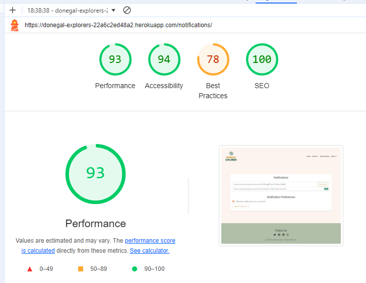

# Testing

## User Story Testing

### EPIC | Frontend Design

*As a user, I can experience a consistent layout and design across all pages so that the site feels cohesive and easy to navigate.*

- The layout is responsive across all screen sizes, and media queries are used to ensure proper scaling.
- The favicon is visible in the browser tab, helping users identify the site when multiple tabs are open.
- The colour scheme and design elements (header, footer, logo) are consistent throughout the site, providing a unified experience.
- A clear navigation bar appears on all pages with easy access to important sections (e.g., "Browse Events," "Add Event").

*As a user, I can quickly view information about Donegal Explorers so that I can understand if the site meets my needs.*

- The homepage includes an "About" section that introduces the platform and provides a clear call to action (e.g., "Sign Up" or "Login").
- The features section displays interactive cards leading to key functionalities, such as browsing events, adding events, and viewing the calendar.

### EPIC | User Account and Authentication

*As a first-time visitor, I can create an account so that I can add, edit, and delete my own event listings.*

- A registration form allows users to enter an email, username, and password.
- Upon successful registration, users receive a verification email before their account is activated.
- The registration process ensures secure account creation and follows email verification protocols.

*As a user, I can log in and out so that I can securely manage my events.*

- A login form is accessible from the navbar, allowing users to enter their credentials.
- A success message confirms when the user is logged in or out.
- The system ensures that only authenticated users can access features like managing events and viewing calendars.

*As a user, I can reset my password so that I can regain access to my account if I forget my login information.*

- A "Forgot Password" link is displayed on the login page.
- Users receive an email with a secure link to reset their password.
- Once reset, users can log in using the new password.

*As a new user, I can request to resend the verification email so that I can activate my account if I didn’t receive the first email.*

- A "Resend Verification Email" option is available on the registration confirmation page.
- The system ensures that verification emails are sent securely and promptly.

### EPIC | Enhanced Event Interactions

*As a user, I can view detailed information about an event so that I can decide if I want to attend.*

- The event detail page shows all relevant information (event name, description, location, dates, times, and images).
- Users can view additional interaction options, such as adding events to their calendar or commenting on events.

*As a user, I can rate events so that I can provide feedback to other users.*

- Users can rate events from 1 to 5 stars.
- The average rating is displayed on the event detail page.
- A user can only rate an event once.

*As a user, I can filter events by rating so that I can find highly-rated events easily.*

- This feature will be considered for future development.

### EPIC | User Feedback and Notifications

*As a user, I can receive confirmation notifications after submitting, editing, or deleting an event so that I know my actions were successful.*

- Success messages are displayed after users submit, edit, or delete events.

*As a user, I can receive notifications when someone comments on my event so that I can engage with feedback and respond.*

- Users receive a notification when comments are added to their events.
- Notifications are displayed in the user's account and can also be sent via email.
- Users have the option to customise notification preferences.

### EPIC | Initial Event Management Setup

*As an event organiser, I can submit a new event so that it can reach more families and increase attendance.*

- Users can fill out a form to submit new events, providing details such as the event name, date, and location.
- Upon successful submission, a confirmation message is displayed, and the event is saved to the database.

*As an event organiser, I can edit an event I have submitted so that I can update the information as needed.*

- The "My Events" page allows users to edit their events using a pre-filled form.
- A success message confirms when the changes have been saved.

*As an event organiser, I can delete an event I have added so that I can remove events that are no longer relevant.*

- Users are prompted to confirm event deletion before the event is permanently removed.
- A success message is displayed after successful deletion.

### EPIC | Site Navigation and Information

*As a site user, I can navigate easily around the app so that I can quickly find relevant content.*

- The navigation bar is visible on all pages, providing quick access to key areas such as "Browse Events" and "My Account."
- The navigation is responsive, collapsing into a mobile-friendly menu on smaller devices.

*As a registered user, I can view my saved events in a calendar so that I can keep track of the events I plan to attend.*

- The "My Calendar" page displays saved events in a calendar format, with clickable event details.
- Users can navigate through months to view past or future events.

### EPIC | Event Calendar and Saved Events

*As a registered user, I can add an event to my calendar so that I can keep track of events I plan to attend.*

- An "Add to Calendar" button is available on each event detail page.
- A success message confirms when the event is successfully added to the user's calendar.

*As a registered user, I can view the events I have saved so that I can manage them easily.*

- The "My Events" page lists all events created by the user.
- Users can view, edit, or delete events directly from this page.

### EPIC | Administrator Tools

*As a site administrator, I can moderate user comments on events so that inappropriate content can be removed.*

- Admins can view, delete, or hide inappropriate comments via both the frontend and within the Django admin panel.

### EPIC | Testing and Documentation

*As a developer, I can run automated tests for key features so that I ensure the site works as expected.*

- Automated tests are implemented for features such as event submission, user registration, and login.
- Tests provide feedback on whether features are working as intended.

*As a developer, I can document all site features so that users and other developers can understand how to use and contribute to the project.*

- The documentation includes setup instructions, feature descriptions, and testing information for both developers and users.

## Validator Testing

### HTML Testing

All HTML pages were run through the [W3C HTML Validator](https://validator.w3.org/). See the results in the table below:

| Page                                 | Logged Out | Logged In |
|--------------------------------------|------------|-----------|
| add_event.html                       | No errors  | No errors |
| base_layout.html                     | n/a        | n/a       |
| browse_events.html                   | No errors  | No errors |
| delete_event.html                    | N/A        | No errors |
| index.html                           | No errors  | No errors |
| my_events.html                       | No errors  | No errors |
| my_calendar.html                     | No errors  | No errors |
| event_detail.html                    | No errors  | No errors |
| notifications.html                   | N/A        | No errors |
| change_password.html                 | N/A        | No errors |
| login.html                           | No errors  | N/A       |
| logout.html                          | N/A        | No errors |
| signup.html                          | No errors  | N/A       |
| manage_email_addresses.html          | N/A        | No errors |
| email_confirm.html                   | No errors  | No errors |
| email_verification_sent.html         | No errors  | No errors |
| password_change.html                 | N/A        | No errors |
| password_reset_done.html             | N/A        | No errors |
| password_reset_from_key_done.html    | N/A        | No errors |
| password_reset_from_key.html         | N/A        | No errors |
| password_reset.html                  | N/A        | No errors |
| signup_closed.html                   | No errors  | N/A       |
| account_inactive.html                | No errors  | No errors |
| base.html                            | N/A        | N/A       |
| 404.html                             | No errors  | No errors |
| email.html                           | No errors  | No errors |
| confirm_delete.html                  | N/A        | No errors |
| delete_comment.html                  | N/A        | No errors |
| edit_comment.html                    | N/A        | No errors |
| edit_event.html                      | N/A        | No errors |
| event_confirmation.html              | N/A        | No errors |
| event_list.html                      | No errors  | No errors |
| rate_event.html                      | No errors  | No errors |
| saved_events.html                    | N/A        | No errors |

During the HTML validation process, some warnings were were identified and resolved. One rror was related to the use of aria-label attributes, particularly on elements that already contained descriptive text. This was corrected by removing unnecessary aria-label attributes where the visual text was sufficient for accessibility. Additionally, the validator flagged potential heading hierarchy problems, prompting updates to ensure that the correct heading levels (h1, h2, etc.) were used consistently in some templates, improving both readability and accessibility for screen readers.

### CSS Testing

All custom CSS files code was validated using the W3C CSS Validator. No errors were found during the validation process, confirming that the CSS complies with modern web standards and is free from any syntactical issues. This ensures that the website's styling is both well-structured and compatible across different browsers and devices.

### Javascript Testing

All custom Javascript code was validated using the JShint Validator. No errors were found during the validation process, with code confirmed to be functioning correctly without any issues across all tested templates and functionalities.

### Python Testing

During the validation of the Python files using PEP8 standards, several issues were identified, mostly related to line length, whitespace, and indentation. Common errors included E501 line too long, where lines exceeded the recommended 79 characters in length, and W293 for blank lines containing unnecessary whitespace. Additionally, E302 errors were flagged for missing blank lines between functions, and E128 continuation line under-indented for visual indent errors occurred when lines were not indented correctly for readability.

To fix these errors, long lines were broken into multiple lines and indented properly for clarity. Additionally, unnecessary trailing and leading whitespaces were removed, and blank lines were adjusted to follow the two-line spacing rule between class or function definitions. These corrections brought the Python code into compliance with PEP8 standards, improving both the structure and readability of the code.

An example of the validation confirmation for the views.py file can be seen below.

[Back to top](<#contents>)

## Responsivity Tests

Throughout the development of the Donegal Explorers website, extensive testing was conducted to ensure its responsive design across various devices. Using Chrome Dev Tools, I simulated different screen sizes and orientations to verify that all elements, including navigation, event listings, and user forms, displayed correctly and functioned seamlessly on a wide range of devices. This testing process was integrated into the development workflow to maintain consistent layout and functionality across screen sizes.

Upon completion, additional testing was conducted using the Responsinator tool to evaluate the site's performance on different browsers, including Chrome, Firefox, and Edge. The site was assessed for screen widths starting at 280 pixels, confirming that there were no issues with stretching, pixelation, or horizontal scrolling. All components, including images, buttons, and text, aligned as expected, maintaining visual integrity and usability on mobile devices, tablets, and desktops.

To further ensure responsive behavior, manual tests were performed on physical devices such as smartphones and tablets. This helped validate touch interactions, button sizes, and overall layout, ensuring a smooth and consistent user experience across all platforms.

The results of these tests, including the range of screen sizes tested, confirm that the Donegal Explorers site adapts effectively to a variety of devices and screen resolutions.

| **Device Tested**                   | **Standard Screen Width** | **Issues Found** |
|-------------------------------------|--------------------------|------------------|
| iPhone eXpensive portrait           | 375px                    | No Issues        |
| iPhone eXpensive landscape          | 734px                    | No Issues        |
| Android (Pixel 2) portrait          | 412px                    | No Issues        |
| Android (Pixel 2) landscape         | 684px                    | No Issues        |
| iPhone 6-8 portrait                 | 667px                    | No Issues        |
| iPhone 6-8 landscape                | 414px                    | No Issues        |
| iPhone 6-8 Plump portrait           | 736px                    | No Issues        |
| iPhone 6-8 Plump landscape          | 768px                    | No Issues        |
| iPad landscape                      | 1024px                   | No Issues        |
| iPhone SE portrait                  | 375px                    | No Issues        |
| iPhone SE landscape                 | 675px                    | No Issues        |
| iPhone XR portrait                  | 414px                    | No Issues        |
| iPhone XR landscape                 | 896px                    | No Issues        |
| iPhone 12 Pro portrait              | 390px                    | No Issues        |
| iPhone 12 Pro landscape             | 932px                    | No Issues        |
| iPhone 14 Pro Max portrait          | 430px                    | No Issues        |
| iPhone 14 Pro Max landscape         | 932px                    | No Issues        |
| Pixel 7 portrait                    | 915px                    | No Issues        |
| Pixel 7 landscape                   | 915px                    | No Issues        |
| Samsung Galaxy S8+ portrait         | 360px                    | No Issues        |
| Samsung Galaxy S8+ landscape        | 740px                    | No Issues        |
| Samsung Galaxy S20 Ultra portrait   | 412px                    | No Issues        |
| Samsung Galaxy S20 Ultra landscape  | 915px                    | No Issues        |
| iPad Mini portrait                  | 768px                    | No Issues        |
| iPad Mini landscape                 | 1024px                   | No Issues        |
| iPad Air portrait                   | 820px                    | No Issues        |
| iPad Air landscape                  | 1180px                   | No Issues        |
| iPad Pro portrait                   | 1024px                   | No Issues        |
| iPad Pro landscape                  | 1366px                   | No Issues        |
| Surface Pro 7 portrait              | 912px                    | No Issues        |
| Surface Pro 7 landscape             | 1368px                   | No Issues        |
| Surface Duo portrait                | 540px                    | No Issues        |
| Surface Duo landscape               | 720px                    | No Issues        |
| Galaxy Fold portrait                | 653px                    | No Issues        |
| Galaxy Fold landscape               | 1280px                   | No Issues        |
| Asus Zenbook Fold portrait          | 653px                    | No Issues        |
| Asus Zenbook Fold landscape         | 1280px                   | No Issues        |

To test the responsiveness of the Donegal Explorers website interface, follow these steps:
1. Navigate to the Donegal Explorers website URL.
2. Open the developer tools in your browser (e.g., Chrome, Firefox).
3. Set the zoom to 50% and select the 'Responsive' mode in the device toolbar.
4. Adjust the screen width to various dimensions, mimicking different devices, to observe how the site adapts to various screen sizes and orientations.

[Back to top](<#contents>)

## Accessibility Testing

Accessibility testing was a key focus throughout the development of the **Donegal Explorers** website to ensure a welcoming and inclusive experience for all users, particularly those utilising assistive technologies. The following key criteria were addressed to meet the Web Content Accessibility Guidelines (WCAG) and enhance usability:

1. **Colour Contrast**: The contrast between text and background colors was carefully checked to meet WCAG 2.1 standards. This ensures readability for users with visual impairments, particularly those with color blindness or low vision. Tools like Chrome DevTools and WebAIM contrast checker were used to verify that all colors across the site met the minimum contrast ratio guidelines.

2. **Heading Structure**: A clear and logical heading hierarchy was implemented across all pages. This helps users who rely on screen readers to navigate and understand the structure of the content easily. The appropriate use of headings also enhances the overall accessibility by allowing users to quickly jump between sections of the page.

3. **Semantic HTML and Landmark Elements**: Content was structured using semantic HTML5 elements such as `<article>`, `<nav>`, `<section>`, and `<footer>` to create logical divisions. These elements assist users of screen readers by providing meaningful navigation cues, allowing them to understand and explore the content more effectively.

4. **Alt Text for Images**: Every image, including icons and buttons, is equipped with descriptive alternative text (alt text). This provides essential context for users relying on screen readers. For decorative images, null alt text (`alt=""`) was used to ensure that screen readers skip over these elements, preventing unnecessary clutter in the auditory experience.

5. **ARIA Attributes**: Appropriate ARIA (Accessible Rich Internet Applications) attributes were applied to interactive elements. This ensures that users with disabilities can understand and interact with the website. Elements such as buttons, links, and form fields have `aria-labels`, ensuring that screen readers provide clear instructions to users on how to operate these controls.

6. **Keyboard Navigation**: All interactive elements, such as forms, links, and buttons, were tested to ensure they are fully navigable via the keyboard. This allows users who cannot use a mouse to interact with the website easily and effectively.

7. **Form Accessibility**: Forms across the website, including the event submission and login forms, have clear labels and validation messages to ensure that users with cognitive or visual impairments can complete forms without confusion. Error messages are prominently displayed and associated with their respective fields using `aria-describedby` and form validation attributes.

8. **Accessible Controls**: Dropdowns, navigation links, and other interactive elements were thoroughly tested for screen reader accessibility and were labeled with ARIA attributes where necessary. This ensures that users who rely on screen readers can easily access and interact with the website's features, such as browsing events, managing notifications, and saving events to their calendar.

9. **Language Declaration**: The `lang="en"` attribute was set in the HTML document to specify that the content is in English. This helps screen readers and other assistive technologies interpret the content accurately and pronounce it correctly.

These accessibility features were rigorously tested using tools such as Chrome DevTools, Lighthouse, and the WAVE Web Accessibility Evaluation Tool. Additionally, manual testing with screen readers like NVDA and keyboard-only navigation was conducted to ensure that all users, regardless of ability, can fully engage with and enjoy the Donegal Explorers platform.

[Back to top](<#contents>)

## Performance Testing

| Page                               | Performance | Accessibility | Best Practices | SEO |
|------------------------------------|:-----------:|:-------------:|:--------------:|:---:|
| Desktop                            |             |               |                |     |
| add_event.html                     | 88          | 95            | 78             | 100 |
| browse_events.html                 | 86          | 91            | 78             | 100 |
| delete_event.html                  | 87          | 94            | 78             | 100 |
| index.html                         | 88          | 96            | 78             | 100 |
| my_events.html                     | 87          | 96            | 78             | 100 |
| my_calendar.html                   | 77          | 94            | 78             | 100 |
| event_detail.html                  | 78          | 96            | 78             | 100 |
| notifications.html                 | 95          | 94            | 78             | 100 |
| change_password.html               | 79          | 94            | 78             | 100 |
| login.html                         | 97          | 96            | 78             | 100 |
| logout.html                        | 89          | 94            | 78             | 100 |
| signup.html                        | 99          | 96            | 78             | 100 |
| manage_email_addresses.html        | 97          | 96            | 78             | 100 |
| email_confirm.html                 | 87          | 98            | 78             | 100 |
| email_verification_sent.html       | 96          | 98            | 74             | 100 |
| password_change.html               | 85          | 94            | 79             | 100 |
| password_reset_done.html           | 85          | 94            | 79             | 100 |
| password_reset_from_key_done.html  | 87          | 96            | 79             | 100 |
| password_reset_from_key.html       | 87          | 96            | 79             | 100 |
| password_reset.html                | 95          | 94            | 78             | 100 |
| signup_closed.html                 | 90          | 93            | 79             | 100 |
| account_inactive.html              | 93          | 93            | 79             | 100 |
| 404.html                           | 96          | 98            | 74             | 100 |
| email.html                         | 85          | 93            | 79             | 100 |
| confirm_delete.html                | 94          | 94            | 78             | 100 |
| delete_comment.html                | 95          | 94            | 78             | 100 |
| edit_comment.html                  | 86          | 94            | 79             | 100 |
| edit_event.html                    | 81          | 95            | 79             | 100 |
| event_confirmation.html            | 86          | 94            | 79             | 100 |
| event_list.html                    | 85          | 93            | 79             | 100 |
| rate_event.html                    | 96          | 94            | 78             | 100 |
| saved_events.html                  | 77          | 96            | 78             | 100 |
|                                    |             |               |                |     |
| Mobile                             |             |               |                |     |
| add_event.html                     | 91          | 93            | 79             | 100 |
| browse_events.html                 | 75          | 90            | 79             | 100 |
| delete_event.html                  | 84          | 93            | 79             | 100 |
| index.html                         | 75          | 96            | 79             | 100 |
| my_events.html                     | 75          | 93            | 79             | 100 |
| my_calendar.html                   | 75          | 93            | 79             | 100 |
| event_detail.html                  | 75          | 95            | 79             | 100 |
| notifications.html                 | 84          | 94            | 79             | 100 |
| change_password.html               | 94          | 94            | 79             | 100 |
| login.html                         | 85          | 95            | 79             | 100 |
| logout.html                        | 90          | 93            | 79             | 100 |
| signup.html                        | 87          | 95            | 79             | 100 |
| manage_email_addresses.html        | 93          | 95            | 79             | 100 |
| email_confirm.html                 | 85          | 98            | 79             | 100 |
| email_verification_sent.html       | 91          | 98            | 79             | 100 |
| password_change.html               | 93          | 94            | 79             | 100 |
| password_reset_done.html           | 93          | 94            | 79             | 100 |
| password_reset_from_key_done.html  | 91          | 96            | 79             | 100 |
| password_reset_from_key.html       | 91          | 96            | 79             | 100 |
| password_reset.html                | 86          | 93            | 79             | 100 |
| signup_closed.html                 | 87          | 93            | 79             | 100 |
| account_inactive.html              | 84          | 93            | 79             | 100 |
| 404.html                           | 91          | 98            | 79             | 100 |
| email.html                         | 75          | 93            | 79             | 100 |
| confirm_delete.html                | 75          | 93            | 79             | 100 |
| delete_comment.html                | 83          | 93            | 79             | 100 |
| edit_comment.html                  | 85          | 93            | 79             | 100 |
| edit_event.html                    | 72          | 93            | 79             | 100 |
| event_confirmation.html            | 85          | 93            | 79             | 100 |
| event_list.html                    | 84          | 93            | 79             | 100 |
| rate_event.html                    | 84          | 94            | 79             | 100 |
| saved_events.html                  | 72          | 93            | 79             | 100 |

[Back to top](<#contents>)

## Automated Testing

Automated testing was implemented to validate the functionality of both the forms and views within the Donegal Explorers project. Testing focused on verifying that various forms behave as expected when submitted, with appropriate validation and error handling, while also ensuring that views rendered correctly and returned the expected HTTP responses.

### Forms Testing
For the forms,  a set of tests were created to ensure that each form correctly validated the provided input, flagged missing or invalid data, and handled the submission process effectively. Specifically:

- **EventForm** was tested for valid and invalid submissions, ensuring that required fields like title, description, and dates were present and correctly formatted. Tests also verified that events with invalid date ranges or times were flagged as invalid.
- **CommentForm** was tested to ensure that comments were correctly validated and that an empty comment field would trigger the appropriate error.
- **NotificationPreferencesForm** and **NotificationSettingsForm** were tested to verify the proper handling of user notification preferences. Tests confirmed that the forms defaulted to sensible values and behaved correctly whether or not data was provided.

#### Key Results:
- No errors or issues were found during the form tests.
- All forms behaved as expected, validating and submitting data correctly.

### Views Testing
Views were thoroughly tested to ensure they returned the correct templates and HTTP responses when accessed. The tests covered:

- **Home Page View**, **Browse Events View**, **Event Detail View**, and other key pages, confirming they loaded successfully with the appropriate status codes (`200 OK`) and rendered the correct templates.
- **Event Creation, Update, and Deletion Views**, ensuring the creation, editing, and deletion of events functioned properly and redirected to the appropriate pages after successful actions.
- **Calendar Views**, such as saving and removing events from a user’s calendar, were tested to confirm the correct handling of calendar-related actions.
- **Notification Views**, ensuring that notifications were marked as read and displayed correctly.

#### Key Results:
- All views returned the correct HTTP status codes and templates.
- Interaction with views, such as creating events and saving to the calendar, behaved as expected with no errors.

The automated tests provided comprehensive coverage of both forms and views, ensuring that the application’s core functionality was reliable and that no errors were encountered during testing.

[Back to top](<#contents>)

## Manual Testing

### Site Navigation

| Element               | Expected Result                                                                 | Pass/Fail |
|-----------------------|---------------------------------------------------------------------------------|-----------|
| NavBar                |                                                                                 |           |
| Site Name (logo area) | Redirect to home                                                                | Pass      |
| Home Link             | Redirect to home                                                                | Pass      |
| Browse Events Link    | Open Browse Events page                                                         | Pass      |
| Add Event Link        | Open Add Event form                                                             | Pass      |
| Add Event Link        | Only visible if user is authenticated                                           | Pass      |
| My Calendar Link      | Open My Calendar page                                                           | Pass      |
| My Calendar Link      | Only visible if user is authenticated                                           | Pass      |
| Account Dropdown      | Open My Account dropdown                                                        | Pass      |
| Account Dropdown      | Text changes to username with profile icon when user is authenticated           | Pass      |
| Sign Up Link          | Open Sign up page                                                               | Pass      |
| Sign Up Link          | Not visible if user is authenticated                                            | Pass      |
| Log In Link           | Open Login page                                                                 | Pass      |
| Log In Link           | Not visible if user is authenticated                                            | Pass      |
| Logout Link           | Open logout confirmation page                                                   | Pass      |
| Logout Link           | Only visible if user is authenticated                                           | Pass      |
| Nav Links Hover       | Links change color when hovered over                                            | Pass      |
| Hamburger Menu        | Responsive, shows up on smaller screens                                         | Pass      |
| Footer                | Links open to all social media pages in a new screen                            | Pass      |

### Home Page

| Element                  | Expected Result                                                                         | Pass/Fail |
|--------------------------|-----------------------------------------------------------------------------------------|-----------|
| Hero 'Sign Up' Button    | Open Sign up page                                                                       | Pass      |
| Card 'Browse' Button     | Open browse event page                                                                  | Pass      |
| Card 'Add Event' Button  | Open Add Event page                                                                     | Pass      |
| Card 'Calendar' Button   | Opens calendar page                                                                     | Pass      |
| Upcoming Events Section  | Correctly displays future events                                                        | Pass      |
| Upcoming Events Section  | Events link to event detail page correctly                                              | Pass      |

### Add Event Page

| Element                           | Expected Result                                                                                     | Pass/Fail |
|-----------------------------------|-----------------------------------------------------------------------------------------------------|-----------|
| Add Event Form                    | Form loads with title, description, date, time, location, image, and status fields                   | Pass      |
| Title Field                       | Display validation error if left blank or too short                                                  | Pass      |
| Title Field                       | Accepts a valid title and form submits successfully                                                  | Pass      |
| Description Field                 | Display validation error if left blank                                                               | Pass      |
| Start Date Field                  | Start date cannot be after the end date, validation error displays                                   | Pass      |
| End Date Field                    | Cannot submit without a valid end date                                                               | Pass      |
| Time Fields                       | Both start and end times must be provided                                                            | Pass      |
| Image Upload                      | Allows user to upload an event image if not placeholder image displays                               | Pass      |
| Status Field                      | Displays status options (Draft, Published) correctly                                                 | Pass      |
| Submit Button (valid form)        | Event is saved and user is redirected to confirmation page                                           | Pass      |
| Submit Button (invalid form)      | Displays appropriate validation errors                                                               | Pass      |
| Non-authenticated user access     | Page is not available to non-authenticated users                                                     | Pass      |
| Form validation (cross-checking)  | Displays error if end date is earlier than start date                                                | Pass      |
| Form validation (empty fields)    | Form won't submit if any required fields (e.g., title, description, date) are left empty             | Pass      |
| Form validation (future dates)    | Ensures event dates cannot be in the past                                                            | Pass      |
| Event Redirect                    | After submission redirects.                                                                          | Pass      |

### Browse Events Page

| Element                | Expected Result                                                                                      | Pass/Fail |
|------------------------|------------------------------------------------------------------------------------------------------|-----------|
| Search Functionality    | Users can search for events by title, location, or description                                       | Pass      |
| Sort Dropdown           | Sorts events by start date, location, or title                                                       | Pass      |
| Event Cards             | Displays correct event details (title, image, location, dates)                                       | Pass      |
| Event Cards Button      | Redirects user to event detail page when clicked                                                     | Pass      |
| Event Button Hover      | Add a subtle hover effect when the user hovers over event cards                                      | Pass      |
| Future Events Only      | Only future events are displayed on the page, no past events are shown                               | Pass      |

### Event Detail Page

| Element                      | Expected Result                                                                                    | Pass/Fail |
|------------------------------|----------------------------------------------------------------------------------------------------|-----------|
| Event Details                 | Displays correct event title, location, start/end date, and time                                  | Pass      |
| Event Image                   | Correct event image displays (or a placeholder image if none uploaded)                            | Pass      |
| Save to Calendar Button       | Adds event to user's calendar when clicked                                                        | Pass      |
| Save to Calendar Button       | Only visible if user is authenticated                                                             | Pass      |
| Edit Event Button             | Only visible to the event author or admin user                                                    | Pass      |
| Delete Event Button           | Only visible to the event author or admin user                                                    | Pass      |
| Comments Section              | Displays user comments below the event details, ordered by newest to oldest                       | Pass      |
| Leave a Comment Form          | Only visible to authenticated users                                                               | Pass      |
| Leave a Comment Validation    | Form displays error message if submitted empty                                                    | Pass      |
| Edit Comment Button           | Only visible to comment author or admin                                                           | Pass      |
| Edit Comment Validation       | Form cannot be submitted if fields are empty                                                      | Pass      |
| Delete Comment Button         | Only visible to comment author or admin                                                           | Pass      |

### My Events Page

| Element                        | Expected Result                                                                                 | Pass/Fail |
|--------------------------------|-------------------------------------------------------------------------------------------------|-----------|
| My Events List                 | Displays events created by authenticated user                                                   | Pass      |
| Edit Event Button              | Redirects to Edit Event page for the selected event                                             | Pass      |
| Delete Event Button            | Opens Delete Event confirmation page                                                            | Pass      |
| No Events Message              | Displays message if no events are created by the user                                           | Pass      |
| Search and sort Filters        | Filters available to search for events and sort by start date                                   | Pass      |

### My Calendar

| Element                        | Expected Result                                                                                      | Pass/Fail |
|--------------------------------|------------------------------------------------------------------------------------------------------|-----------|
| Calendar Page Access           | Redirects to login page if user is not authenticated                                                 | Pass      |
| Calendar Page Display          | Displays all events saved by the authenticated user in a calendar view                               | Pass      |
| Calendar Navigation            | User can navigate between months (current and future)                                                 | Pass      |
| Calendar Event Display         | Events are displayed on the correct dates on the calendar                                             | Pass      |
| No Events Message              | Displays a message if no events are saved for the selected month                                       | Pass      |
| Past Events Display            | Past events are not displayed in the calendar view                                                     | Pass      |
| Remove Event from Calendar     | User can remove events from the calendar                                                               | Pass      |
| Event Image Display            | Event images (if available) are displayed in the calendar popup when hovering over the event            | Pass      |
| Event Date and Time Display    | Correct start and end dates/times are displayed for the events                                         | Pass      |
| Responsive Calendar Display    | The calendar view is responsive and adjusts for mobile/tablet screen sizes                             | Pass      |
| Mobile View                    | On mobile view, the calendar displays events in a list format, with correct event details shown        | Pass      |
| Calendar Filter by Month       | User can filter events by selecting a specific month from the dropdown                                 | Pass      |
| Filter Form Submission         | After selecting a month and submitting, events for that month are displayed correctly                  | Pass      |
| Empty Calendar Month           | If no events exist for the selected month, a message is displayed indicating no saved events           | Pass      |

### Notifications Page

| Element                            | Expected Result                                                                            | Pass/Fail |
|------------------------------------|--------------------------------------------------------------------------------------------|-----------|
| Notifications List                 | Displays list of user notifications                                                        | Pass      |
| Mark as Read Button                | Marks notification as read and updates the display                                          | Pass      |
| Notification Preferences Form      | Displays a form to manage notification preferences                                          | Pass      |
| Update Preferences Button          | Submits the form and updates preferences                                                    | Pass      |

### Email Management Page

| Element                            | Expected Result                                                                            | Pass/Fail |
|------------------------------------|--------------------------------------------------------------------------------------------|-----------|
| Email List                         | Displays a list of user's emails with verification status                                  | Pass      |
| Make Primary Button                | Allows user to set an email as primary                                                     | Pass      |
| Remove Email Button                | Allows user to remove an email address (unless it's the primary email)                     | Pass      |
| Re-send Verification Button        | Allows user to re-send a verification email for unverified addresses                        | Pass      |
| Add Email Form                     | Allows user to add a new email address                                                     | Pass      |
| Form Validation                    | Displays validation error if an invalid email format is entered                            | Pass      |

### Password Reset Pages

| Element                            | Expected Result                                                                            | Pass/Fail |
|------------------------------------|--------------------------------------------------------------------------------------------|-----------|
| Request Password Reset Form        | Displays email field for user to request a password reset                                  | Pass      |
| Request Password Reset Validation  | Displays error message if email is invalid or not associated with any account              | Pass      |
| Password Reset Email               | Sends reset link to user's email                                                           | Pass      |
| Enter New Password Form            | Allows user to enter a new password, and submit it to reset the account password            | Pass      |
| Enter New Password Validation      | Displays error if the passwords don't match                                                | Pass      |
| Success Message                    | Displays success message once password reset is completed                                  | Pass      |

### 404 Error Page

| Element                 | Expected Result                                                                  | Pass/Fail |
|-------------------------|----------------------------------------------------------------------------------|-----------|
| 404 Page Display         | Displays custom 404 error message                                                | Pass      |
| Return Home Button       | Redirects user back to the home page                                             | Pass      |
| Custom Styling           | Ensures custom branding and colors appear on the 404 page                        | Pass      |

---