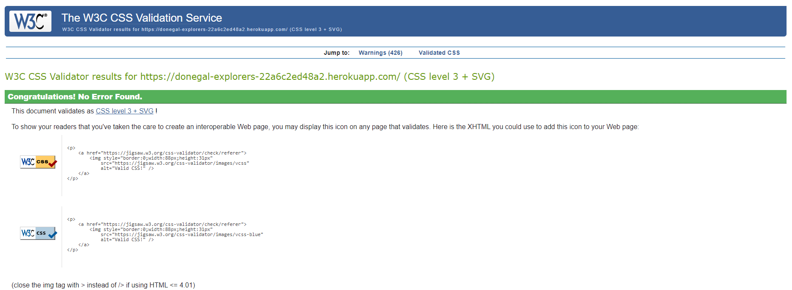
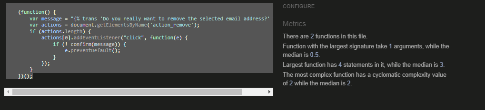
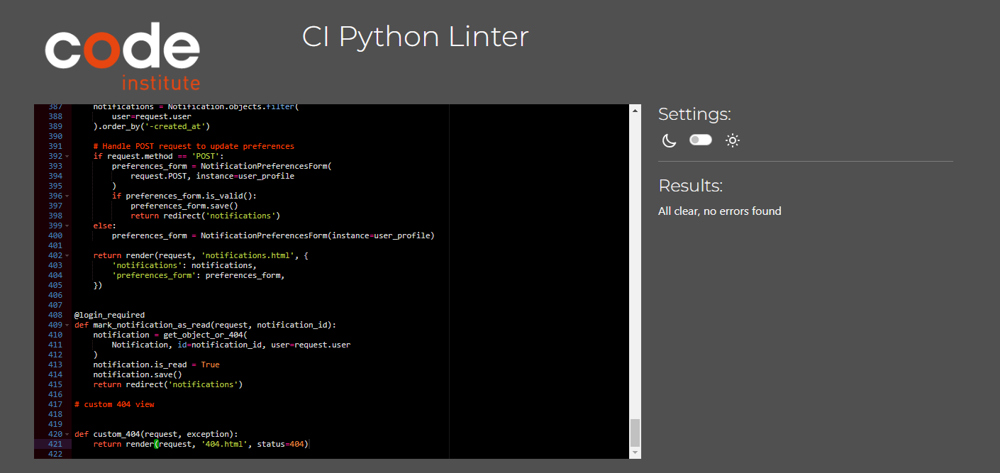

# Testing

## User Story Testing

### EPIC | Frontend Design

*As a user, I can experience a consistent layout and design across all pages so that the site feels cohesive and easy to navigate.*

- The layout is responsive across all screen sizes, and media queries are used to ensure proper scaling.
- The favicon is visible in the browser tab, helping users identify the site when multiple tabs are open.
- The colour scheme and design elements (header, footer, logo) are consistent throughout the site, providing a unified experience.
- A clear navigation bar appears on all pages with easy access to important sections (e.g., "Browse Events," "Add Event").

*As a user, I can quickly view information about Donegal Explorers so that I can understand if the site meets my needs.*

- The homepage includes an "About" section that introduces the platform and provides a clear call to action (e.g., "Sign Up" or "Login").
- The features section displays interactive cards leading to key functionalities, such as browsing events, adding events, and viewing the calendar.

### EPIC | User Account and Authentication

*As a first-time visitor, I can create an account so that I can add, edit, and delete my own event listings.*

- A registration form allows users to enter an email, username, and password.
- Upon successful registration, users receive a verification email before their account is activated.
- The registration process ensures secure account creation and follows email verification protocols.

*As a user, I can log in and out so that I can securely manage my events.*

- A login form is accessible from the navbar, allowing users to enter their credentials.
- A success message confirms when the user is logged in or out.
- The system ensures that only authenticated users can access features like managing events and viewing calendars.

*As a user, I can reset my password so that I can regain access to my account if I forget my login information.*

- A "Forgot Password" link is displayed on the login page.
- Users receive an email with a secure link to reset their password.
- Once reset, users can log in using the new password.

*As a new user, I can request to resend the verification email so that I can activate my account if I didn’t receive the first email.*

- A "Resend Verification Email" option is available on the registration confirmation page.
- The system ensures that verification emails are sent securely and promptly.

### EPIC | Enhanced Event Interactions

*As a user, I can view detailed information about an event so that I can decide if I want to attend.*

- The event detail page shows all relevant information (event name, description, location, dates, times, and images).
- Users can view additional interaction options, such as adding events to their calendar or commenting on events.

*As a user, I can rate events so that I can provide feedback to other users.*

- Users can rate events from 1 to 5 stars.
- The average rating is displayed on the event detail page.
- A user can only rate an event once.

*As a user, I can filter events by rating so that I can find highly-rated events easily.*

- This feature will be considered for future development.

### EPIC | User Feedback and Notifications

*As a user, I can receive confirmation notifications after submitting, editing, or deleting an event so that I know my actions were successful.*

- Success messages are displayed after users submit, edit, or delete events.

*As a user, I can receive notifications when someone comments on my event so that I can engage with feedback and respond.*

- Users receive a notification when comments are added to their events.
- Notifications are displayed in the user's account and can also be sent via email.
- Users have the option to customise notification preferences.

### EPIC | Initial Event Management Setup

*As an event organiser, I can submit a new event so that it can reach more families and increase attendance.*

- Users can fill out a form to submit new events, providing details such as the event name, date, and location.
- Upon successful submission, a confirmation message is displayed, and the event is saved to the database.

*As an event organiser, I can edit an event I have submitted so that I can update the information as needed.*

- The "My Events" page allows users to edit their events using a pre-filled form.
- A success message confirms when the changes have been saved.

*As an event organiser, I can delete an event I have added so that I can remove events that are no longer relevant.*

- Users are prompted to confirm event deletion before the event is permanently removed.
- A success message is displayed after successful deletion.

### EPIC | Site Navigation and Information

*As a site user, I can navigate easily around the app so that I can quickly find relevant content.*

- The navigation bar is visible on all pages, providing quick access to key areas such as "Browse Events" and "My Account."
- The navigation is responsive, collapsing into a mobile-friendly menu on smaller devices.

*As a registered user, I can view my saved events in a calendar so that I can keep track of the events I plan to attend.*

- The "My Calendar" page displays saved events in a calendar format, with clickable event details.
- Users can navigate through months to view past or future events.

### EPIC | Event Calendar and Saved Events

*As a registered user, I can add an event to my calendar so that I can keep track of events I plan to attend.*

- An "Add to Calendar" button is available on each event detail page.
- A success message confirms when the event is successfully added to the user's calendar.

*As a registered user, I can view the events I have saved so that I can manage them easily.*

- The "My Events" page lists all events created by the user.
- Users can view, edit, or delete events directly from this page.

### EPIC | Administrator Tools

*As a site administrator, I can moderate user comments on events so that inappropriate content can be removed.*

- Admins can view, delete, or hide inappropriate comments via both the frontend and within the Django admin panel.

### EPIC | Testing and Documentation

*As a developer, I can run automated tests for key features so that I ensure the site works as expected.*

- Automated tests are implemented for features such as event submission, user registration, and login.
- Tests provide feedback on whether features are working as intended.

*As a developer, I can document all site features so that users and other developers can understand how to use and contribute to the project.*

- The documentation includes setup instructions, feature descriptions, and testing information for both developers and users.

## Validator Testing

### HTML Testing

All HTML pages were run through the [W3C HTML Validator](https://validator.w3.org/). See the results in the table below:

| Page                                 | Logged Out | Logged In |
|--------------------------------------|------------|-----------|
| add_event.html                       | No errors  | No errors |
| base_layout.html                     | n/a        | n/a       |
| browse_events.html                   | No errors  | No errors |
| delete_event.html                    | N/A        | No errors |
| index.html                           | No errors  | No errors |
| my_events.html                       | No errors  | No errors |
| my_calendar.html                     | No errors  | No errors |
| event_detail.html                    | No errors  | No errors |
| notifications.html                   | N/A        | No errors |
| change_password.html                 | N/A        | No errors |
| login.html                           | No errors  | N/A       |
| logout.html                          | N/A        | No errors |
| signup.html                          | No errors  | N/A       |
| manage_email_addresses.html          | N/A        | No errors |
| email_confirm.html                   | No errors  | No errors |
| email_verification_sent.html         | No errors  | No errors |
| password_change.html                 | N/A        | No errors |
| password_reset_done.html             | N/A        | No errors |
| password_reset_from_key_done.html    | N/A        | No errors |
| password_reset_from_key.html         | N/A        | No errors |
| password_reset.html                  | N/A        | No errors |
| signup_closed.html                   | No errors  | N/A       |
| account_inactive.html                | No errors  | No errors |
| base.html                            | N/A        | N/A       |
| 404.html                             | No errors  | No errors |
| email.html                           | No errors  | No errors |
| confirm_delete.html                  | N/A        | No errors |
| delete_comment.html                  | N/A        | No errors |
| edit_comment.html                    | N/A        | No errors |
| edit_event.html                      | N/A        | No errors |
| event_confirmation.html              | N/A        | No errors |
| event_list.html                      | No errors  | No errors |
| rate_event.html                      | No errors  | No errors |
| saved_events.html                    | N/A        | No errors |

During the HTML validation process, some warnings were were identified and resolved. One rror was related to the use of aria-label attributes, particularly on elements that already contained descriptive text. This was corrected by removing unnecessary aria-label attributes where the visual text was sufficient for accessibility. Additionally, the validator flagged potential heading hierarchy problems, prompting updates to ensure that the correct heading levels (h1, h2, etc.) were used consistently in some templates, improving both readability and accessibility for screen readers.

### CSS Testing

All custom CSS files code was validated using the W3C CSS Validator. No errors were found during the validation process, confirming that the CSS complies with modern web standards and is free from any syntactical issues. This ensures that the website's styling is both well-structured and compatible across different browsers and devices.

### Javascript Testing

All custom Javascript code was validated using the JShint Validator. No errors were found during the validation process, with code confirmed to be functioning correctly without any issues across all tested templates and functionalities.

### Python Testing

During the validation of the Python files using PEP8 standards, several issues were identified, mostly related to line length, whitespace, and indentation. Common errors included E501 line too long, where lines exceeded the recommended 79 characters in length, and W293 for blank lines containing unnecessary whitespace. Additionally, E302 errors were flagged for missing blank lines between functions, and E128 continuation line under-indented for visual indent errors occurred when lines were not indented correctly for readability.

To fix these errors, long lines were broken into multiple lines and indented properly for clarity. Additionally, unnecessary trailing and leading whitespaces were removed, and blank lines were adjusted to follow the two-line spacing rule between class or function definitions. These corrections brought the Python code into compliance with PEP8 standards, improving both the structure and readability of the code.

An example of the validation confirmation for the views.py file can be seen below.

---